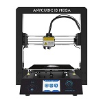
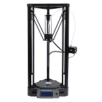

#Background

Anycubic opened its doors in China in 2011, as Shenzhen Anycubic Technology Co. Since then Anycubic has started producing a range of printers and now export their printer all across the world.
Anycubic features a range of printers to suit your needs.

 
#3D Printers

 [Anycubic I3 Mega](AncubicI3Mega.md)  
 [Anycubic Kossel Delta](AnyycubicKossDelt.md)  