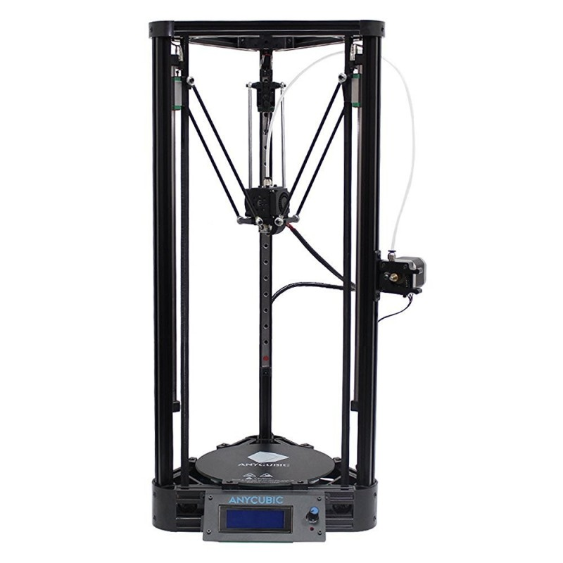

#About

With t-slot aluminium extrusion and linear rails for precision and easy assembly, the Anycubic Kossel Delta is a cost effective printer for beginners.

##Specifications

|Specs|Value
|-|-|
|Nozzle Diameter| 0.4mm  
|Nozzle Type| E3D
|Print area| Ø230 x 270 mm
|Heated-Bed Max Temperature| none
|Hot-End Max Temperature| 275°C   
|Print Speed (Stable)| 50mm/s 
|Print Speed (Max)| 100m/s 
|Layer Thickness| 50-350 μm      
|Filament Diameter| 1.75mm
|Extruder Style| Bowden 
|Power Supply| 12V 48W
|Printer Footprint| Ø385 x 680 mm

##Build guide

The video below has a full assembly guide to your Anycubic Kossel Delta

