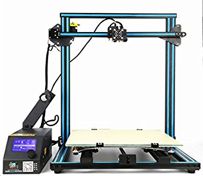

# About

Based on the CR-10 comes the CR-10S! This durable printer comes with Dual lead screws and a filament detector to maximize print quality.

# Specifications

|Specifications| CR10S
|-|-|
|Printing Technology| – FDM
|Build Volume| – 300 x 300 x 300mm
|Chassis Size (Desk Space Required)| – 623 x 660 x 610mm
|Filament Diameter Compatibility| – 1.75mm
|Extruder Style| – Bowden-Style
|Stock Nozzle| – [0.4mm Creality MK8 Nozzle](https://www.diyelectronics.co.za/store/mk-range/1898-4mm-mk8-nozzle-creality-original.html)
|Stock Hotend Assembly| – [Creality MK8 Hotend Assembly](https://www.diyelectronics.co.za/store/hotend-assemblies/1861-creality-cr-10-hotend-assembly.html)
|Maximum Hotend Temperature| – 260°C
|Print Platform Style| – Heated Aluminium Bed with Glass Pane
|Print Platform Max Temperature| – 90°C
|Printing Speed (Stable)| – 80mm/s
|Printing Speed (Max)| – 200mm/s
|Layer Height (Resolution)| – 100 to 300 microns
|Motherboard / Primary Controller| – [Creality3D V2.1 Motherboard](https://www.diyelectronics.co.za/store/controller-boards/1981-replacement-creality-cr-10s-motherboard-v21.html)
|User Interface| – LCD Screen with Rotary Encoder (Built-In)
|Slicing Software Compatibility| – Cura / Simplify3D / Slic3r / Repetier Host
|File Format Compatibility| – STL / OBJ / DAE / AMF
|File Transfer Method| – SD Card / USB
|Bed Levelling System| – Manual with Optional Upgrade
|Print Resume Functionality| – Included
|Filament Runout Sensor| – Included
|Chassis Materials| – Black Anodised Aluminium
|Included Slicing Software| – Cura
|Included 3D Printing Filament| – ±200g of PLA Filament
|Distinct Features| – Upgraded CR-10 with New Features
|Weight (Printer)| – 13.4kg
|Weight (Package)| – 15.5kg
|Operating Voltage| – 12V DC
|Power Supply Input| – 110V/220V AC, 50/60Hz
|Power Supply Output| – 12V, 30A, 360W | S-360-12

# User Guide

The video below gives a quick tutorial on how to assemble your CR10 from Creality

