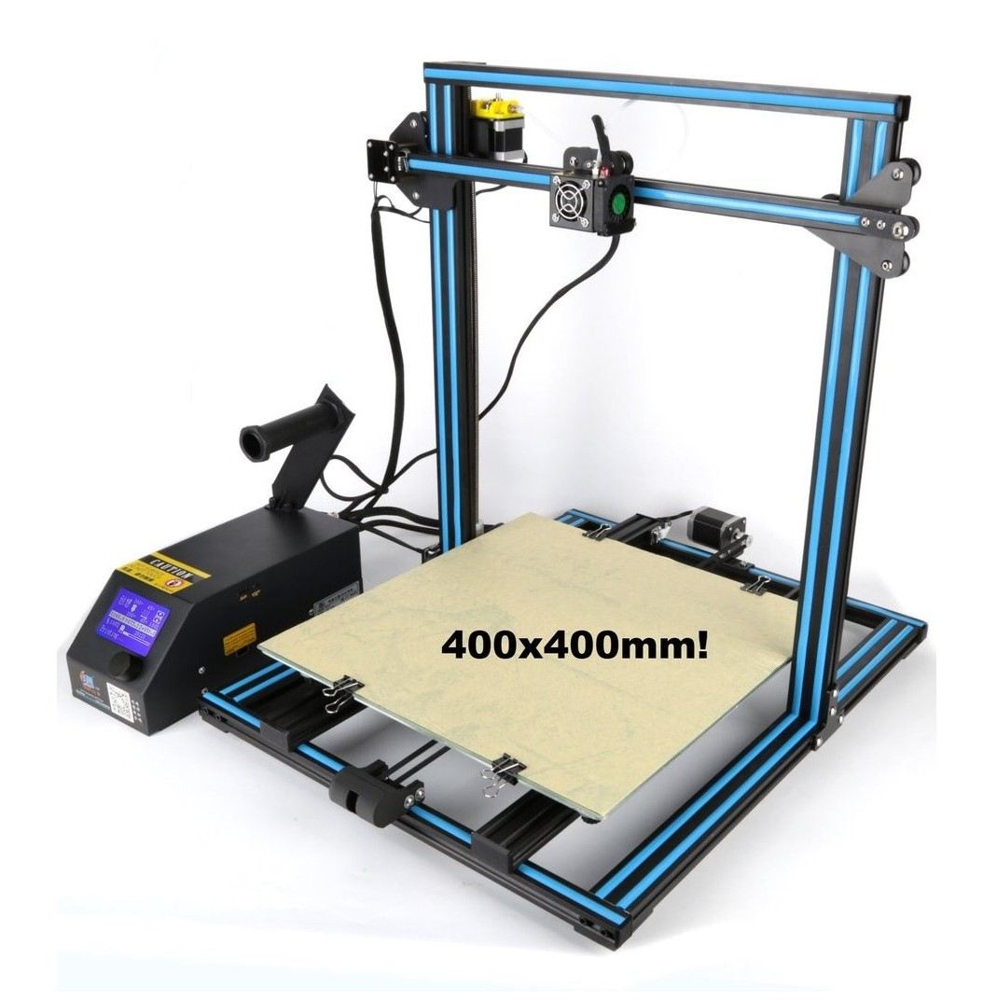

# About

Based on the CR-10 the CR-10S4 comes with a print volume of 400x400x400mm. This durable printer comes with Dual lead screws and a filament detector to maximize print quality.

# Specifications

|Specs|Value
|-|-|
|Nozzle Diameter| 0.4mm  
|Filament Diameter| 1.75mm
|Print area| 400 x 400 x 400mm 
|Hot Bed Temperature| 110°C 
|Hot End Temperature| 260 °C
|System| Windows, Linux, Mac  
|Power Supply| 360W
|Print Speed| Normal: 50mm/s - Max: 80mm/s 
|Layer Thickness|50-350μm     
|SD-Card Support| yes 
|Extruder Style| Extruder

# User Guide

The video below gives a quick tutorial on how to assemble your CR10 from Creality

