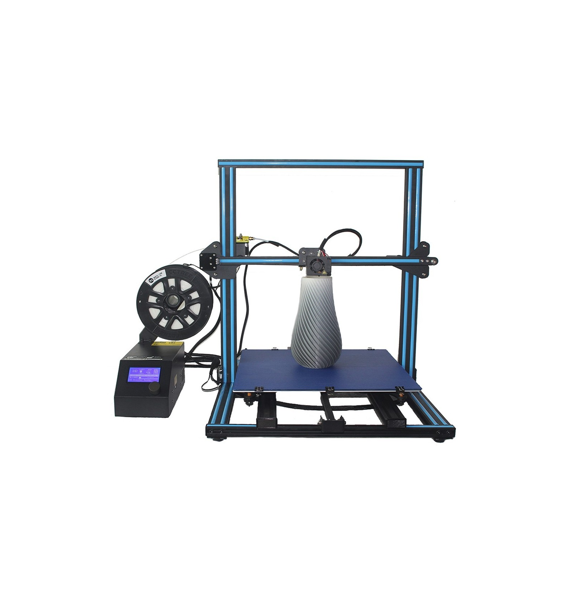

# About

Based on the CR-10 the CR-10S5 comes with a print volume of 500x500x500mm. This durable printer comes with Dual lead screws and a filament detector to maximize print quality as well as a start stop print function.

# Specifications

|Specs|Value
|-|-|
|Nozzle Diameter| 0.4mm  
|Nozzle Type| MK8
|Print area| 500 x 500 x 500 mm
|Heated-Bed Max Temperature| 110°C
|Hot-End Max Temperature| 260°C   
|Print Speed (Stable)| 50mm/s 
|Print Speed (Max)| 80mm/s 
|Layer Thickness| 50-350 μm      
|Filament Diameter| 1.75mm
|Extruder Style| Bowden 
|Power Supply| 12V 360W
|Printer Footprint| 813 x 1030 x 712 mm

# User Guide

The video below gives a quick tutorial on how to assemble your CR10 from Creality

