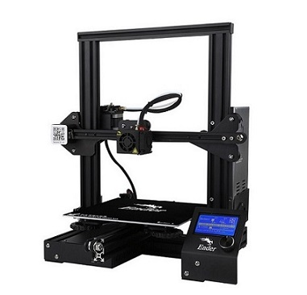

# About

The Creality Ender 3 is taking over, this highly popular printer is the choice of the masses and we can see why. The ender 3 follows in the footsteps of the CR10 series with a sturdy cross-bar gantry frame to ensure a steady print, the only difference is the size and the price!
The Creality Ender series is a highly supported printer with an abundance of information and modifications provided by the printing community.

# Specifications

|Specs|Value
|-|-|
|Nozzle Diameter| 0.4mm  
|Filament Diameter| 1.75mm
|Print area| 220 x 220 x 250 mm
|Hot Bed Temperature| 110°C
|Hot End Temperature| 260°C   
|System| Windows, Linux, Mac  
|Power Supply| 360W
|Print Speed| Normal: 50mm/s - Max: 70mm/s 
|Layer Thickness| 50-350 μm      
|SD-Card Support| yes
|Extruder Style| Bowden 

# User Guide

For Cura settings for your Ender 3 check out the video below!

For suggested upgrades and modifications check out this informative guide by ALL3DP!  
 [20 Must have mods for Ender 3](https://all3dp.com/1/20-must-creality-ender-3-upgrades-mods/)
