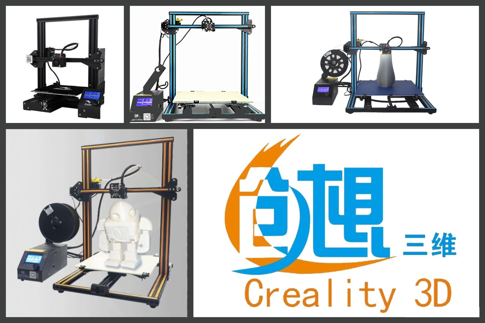
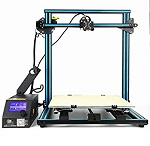
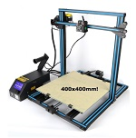
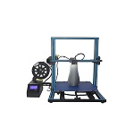
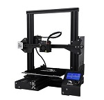
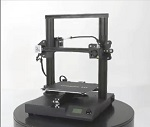

#Background

Founded in 2014, Creality3D is fully devoted to the production of their printers. Creality has managed to produce superb printers by putting user experience first.
Creality is dedicated to improving their printers with each new version promising a host of new features inspired by the users.

 
#3D Printer
|||
|-|-|
| [Creality CR10](crealityCR10.md)  | [Creality CR10S](Creality10S.md)  |
| [Creality CR10 S4](Creality10S4.md)  | [Creality CR10 S5](Creality10S5.md)  

| [Creality Ender 3](CrealityEnder3.md)  | [Creality CR20](CrealityCR20.md)  |
