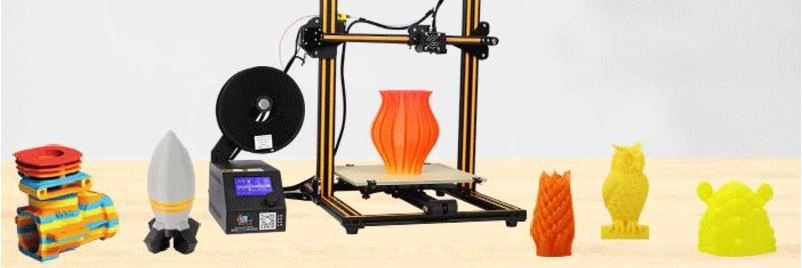

# About

With quick installation and low prices, its easy to see why the Creality CR-10 is becoming so popular amongst our costumers.

The design of this printer promotes high accuracy and low noise with a large build volume.

# Specifications

|Specs|Value
|-|-|
|Nozzle Diameter| 0.4mm  
|Nozzle Type| MK8
|Print area| 300 x 300 x 400 mm
|Heated-Bed Max Temperature| 110°C
|Hot-End Max Temperature| 260°C   
|Print Speed (Stable)| 50mm/s 
|Print Speed (Max)| 80mm/s 
|Layer Thickness| 50-350 μm      
|Filament Diameter| 1.75mm
|Extruder Style| Bowden 
|Power Supply| 12V 360W
|Printer Footprint| 615 x 600 x 490 mm

# User Guide

The video below gives a quick tutorial on how to assemble your CR10 from Creality

