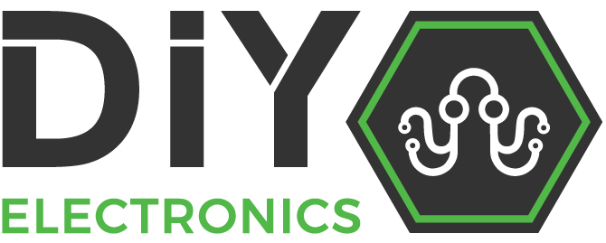
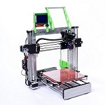
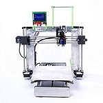

#Background

DIYElectronics started in 2013 and has blossomed in to the company you know today. 
DIY started with an idea for a Prusa i3 and a handful of electronics. Our engineers knew the importance of innovation, open source and creating a product that can be called proudly South African.
We at DIY are confident in our printer designs and therefore supply our costumers with support and guidance through their 3d printing experience.

#3D Printers

 [DIYElectronics Prusa I3](builddoc.md)  
 [DIYElectronics Prusa I3 Premium](builddocprem.md)  

