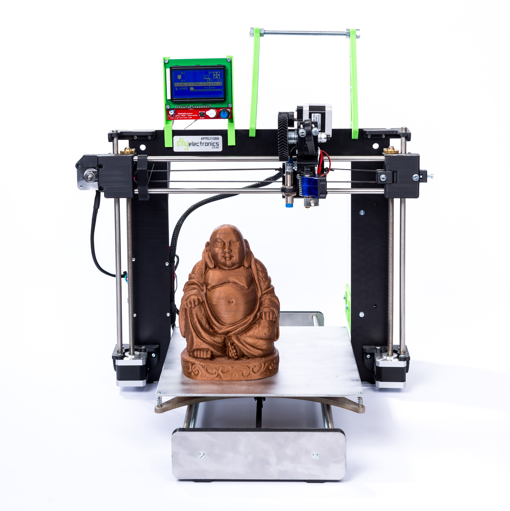
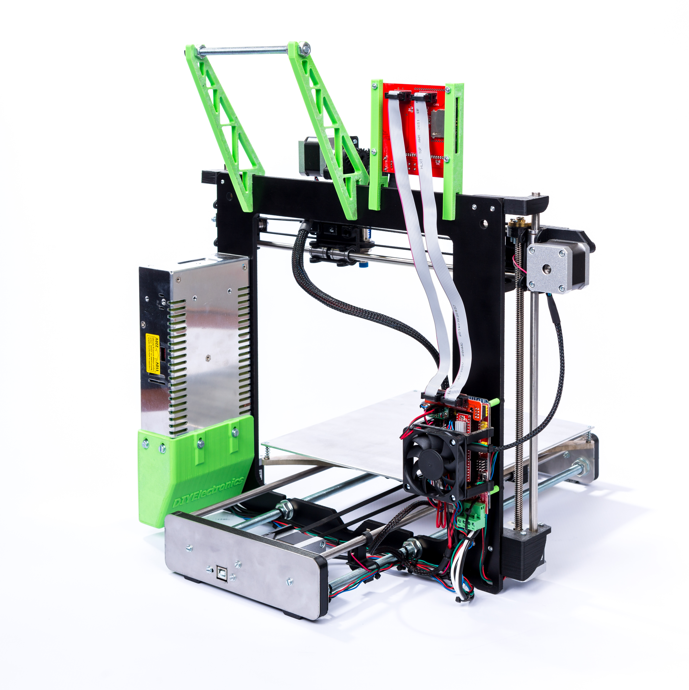

|||
|-|-|
|||

##Build Documentation
* [DIY I3 Premium Mechanical guide](DIY_I3_premium_v5.pdf)
* [I3 Electronics and Software guide](I3 Electronics and Software guide.pdf)
* [CharlStruder assembly guide](CharlStruder assembly guide.pdf)
* [I3 Auto-leveling manual](Auto leveling manual.pdf)

##Specifications

|Specs|Value
|-|-|
|Nozzle Diameter| 0.4/0.5mm  
|Filament Diameter| 1.75mm    
|Hot Bed Temperature | 100°C max
|System| RAMPS 1.4   
|Power Supply| 240W  
|Print Speed| 100mm/s max  
|Layer Thickness| 0.025mm - 0.5mm    
|SD-Card Support| yes  
|Max. Resolution| 0.01mm   
|Printing Software | Marlin Firmware supported by Cura, Simplify3D,   Repetier-Host and many more slicers    
|Language| English   