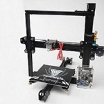

||||
|-|-|-|
|| | |

The Tevo Tarantula has multiple options for bed size as well as interchagable extruder.
The Tevo Tarantula design is based on the Prusa i3. The design for this printer is all OpenSource and a part of the RepRap project.

##Specifications
|Specs|Value
|-|-|
|Nozzle Diameter| 0.4mm  
|Nozzle Type| E3D
|Print area| 200 x 200 x 200 mm
|Heated-Bed Max Temperature| 110°C
|Hot-End Max Temperature| 260°C   
|Print Speed (Stable)| 40mm/s 
|Print Speed (Max)| 70mm/s 
|Layer Thickness| 50-350 μm      
|Filament Diameter| 1.75mm
|Extruder Style| Bowden 
|Power Supply| 12V 60W
|Printer Footprint| 430 x 440 x 400 mm

#Build guide

Tevo Tarantula: Axis Mount

Tevo Tarantula: Hot End

Tevo Trantula: Z Axis Left Side

Tevo Tarantula: Z Axis Right Side

Tevo Tarantula: The Bed

Tevo Tarantula: The Frame

Tevo Tarantula: Front Y Pulley

Tevo Tarantula: Y Motor Mount

Tevo Tarantula: Mounting X/Z Axis Rail

Tevo Tarantula: Top Rail, Squaring it up

Tevo Tarantula: Z Rod and Motor

Tevo Tarantula: X Axis Belt

Tevo Tarantula: Y Axis Belt, Bed Mount

Tevo Tarantula: Extruder

Tevo Tarantula: Wiring the Power Supply

Tevo Tarantula: PCB Mount

Tevo Tarantula: Wiring Part 1

Tevo Tarantula: Wiring Part 2

Tevo Tarantula: End Stops

Tevo Tarantula: LCD Aseembly

Tevo Tarantula: Manual Bed Level

Tevo Tarantula: Loading Filament

Tevo Tarantula: First Print

