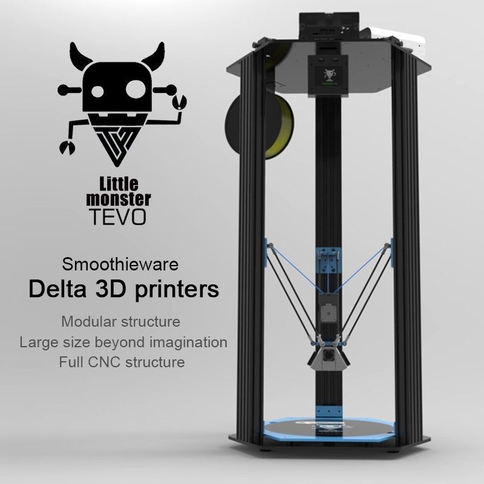

#About

This partially pre-assembled printer is a great addition to your 3D printer collection. Dont be fooled by its name, the Little Monster comes with a large build volume of 340mm by 500mm.

#Specifications
|Specs|Value
|-|-|
|Nozzle Diameter| 0.4mm  
|Filament Diameter| 0.175mm
|Build volume​| 340 D x 500 H mm   
|Hot Bed Temperature| 120 °C
|System| Windows, Linux, Mac  
|Power Supply| 240V  
|Print Speed| 150 mm/s  
|Layer Thickness| 0.1-0.4mm  
|SD-Card Support| yes  
|Max. Resolution| 0.1mm    
|Z Axis Positioning Accuracy| 0.002mm    
|XY Axis Positioning Accuracy| 0.010mm  
|Language| English   

#Build guide
Follow the link below to a full build guide to the Tevo Little Monster printer

[Little Monster guide](Monster Manual.pdf)