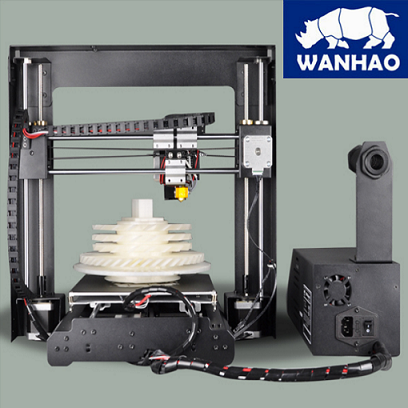

|||
|-|-|
|||

#About
A robust and economical version of the Prusa i3, this machine is a great machine for a beginner. The printer comes in a fully assembled steel frame. The Duplicator i3 comes equipped with a cooling fan, gcode based micro-controller and a standard Heated Build Plate.

#Specifications

|Specifications| Duplicator I3 plus|
|-|-|
|Printing Technology|– FDM
|Build Volume|– 200 x 200 x 180mm
|Chassis Size (Desk Space Required)| – 400 x 410 x 400mm
|Filament Diameter Compatibility| – 1.75mm
|Extruder Style| – Direct Drive
|Stock Nozzle| – [0.4mm MK10 Nozzle](https://www.diyelectronics.co.za/store/mk-range/1270-4mm-mk10-nozzle-for-175mm-filament.html)
|Stock Hotend Assembly| – Wanhao i3 Plus MK10 Hotend
|Maximum Hotend Temperature| – 260°C
|Print Platform Style| – Aluminium Heated Bed / Magnetic Flexy-Sheet
|Print Platform Max Temperature| – 100°C
|Printing Speed (Stable)| – 60mm/s
|Printing Speed (Max)| – 100mm/s
|Layer Height (Resolution)| – 0.1 to 0.4mm
|Motherboard / Primary Controller| – Melzi V5.4 Control Board
|User Interface| – Onboard LCD with Rotary Encoder
|Slicing Software Compatibility| – Cura / Simplify3D / Slic3r / Repetier Host
|File Format Compatibility| – STL / OBJ / DAE / AMF
|File Transfer Method| – SD Card / USB
|Bed Levelling System| – Automatic 4-Point Levelling (Inductive)
|Power-Loss Print Resume| – Included
|Filament Runout Sensor| – Not Included
|Chassis Materials| – Rigid Anodised Steel
|Included Slicing Software| – Cura
|Included 3D Printing Filament| – 10 Meter PLA Filament Sample
|Distinct Features| – Removable Flexible Adhesive Print Surface
|Weight (Printer)| – 10kg
|Weight (Package)|– 12kg
|Operating Voltage| – 24V DC
|Power Supply Input| – 110V/220V AC, 50/60Hz
|Power Supply Output| – 24V 10.4A 250W | LRS-250-24

#User Manual
Follow the link below to the Wanhao i3 V2 user manual

[Wanhao i3 V2 User manual](WANHAO-User-Manual-REV-A.pdf)