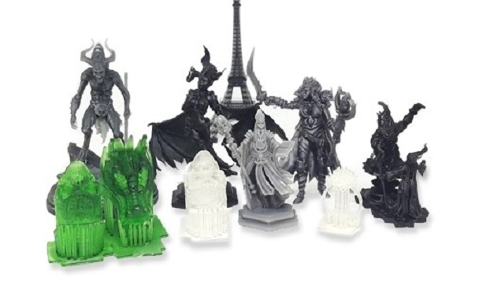

#About

The D7 is the latest DLP resin printer from Wanhao. The D7 resin printer creates your print by curing resin layer by layer.
Equipped with an HD LCD screen you can easily control your print.

|||
|-|-|
|| 

|Specs|Value
|-|-|    
|System| Windows, Linux, Mac  
|Power Supply| 110 to 250V Auto-Switch - 50/60Hz
|Print Speed| 30mm/hour       
|SD-Card Support| yes  
|Max. Resolution| 35micron   
|Print Are| 120 x 68 x180 mm
|Language| English  
|File type| OBJ, STL 
|Resin Support| 405nm Resin

#user manual

[D7 user guide](Duplicator7_USER_MANUAL_REV.A.pdf)

__Currently no Duplicator 7 plus manual available__