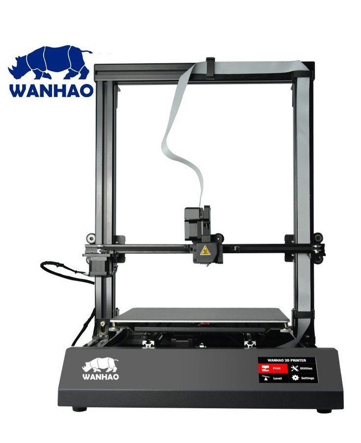
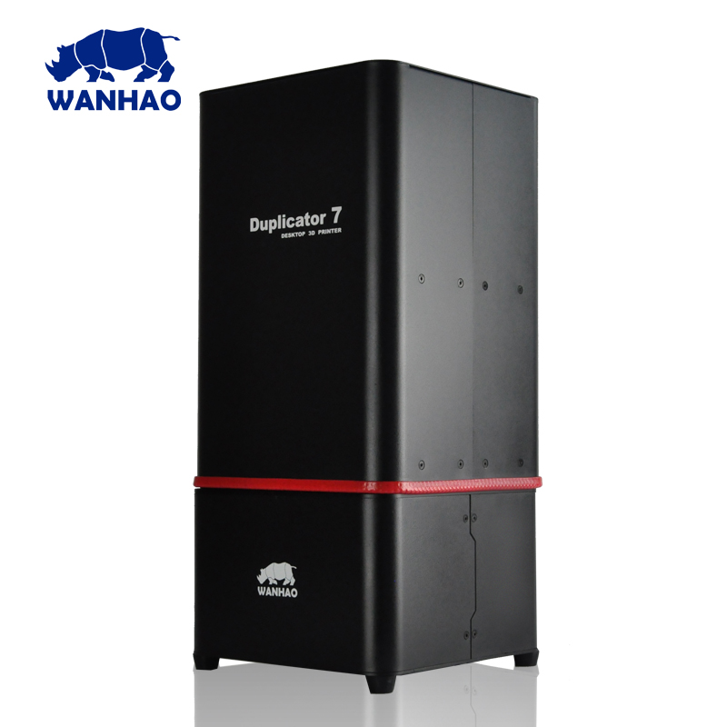
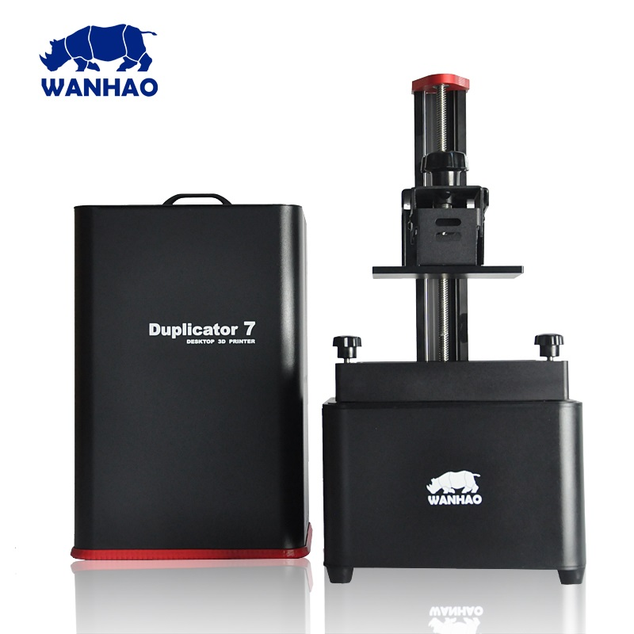

#About

The D9 is the first in the new D9 series from Wanhao. This comes with new features such as anti-backlash rolling system, single cable extruder connection and a touch screen display.
Unique Features
– Anti-Backlash Rolling System

– Pause/Resume Print Function

– Machined Metal Stability Brackets

– Smart Integrated Touch Display

– Closed PSU & Cable Alignments

|||
|-|-|
|| 

|Specs|Value
|-|-|
|Nozzle Diameter| 0.4mm  
|Nozzle Type| MK10
|Print area| 300 x 300 x 400 mm
|Heated-Bed Max Temperature| 110°C
|Hot-End Max Temperature| 260°C   
|Print Speed (Stable)| 50mm/s 
|Print Speed (Max)| 80mm/s 
|Layer Thickness| 50-350 μm      
|Filament Diameter| 1.75mm
|Extruder Style| Direct Drive 
|Power Supply| 12V 350W
|Printer Footprint| 350 x 500 x 600 mm

#user manual

__Currently no Duplicator 9 plus manual available__