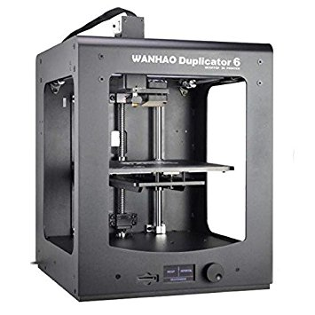

#About

The Wanhao D6 boasts a smaller, lighter and faster extruder design to increase print quality and layer alignment. The D6 comes with a digital display to make settings and operations easier for the user. The double- track gantry system reduces vibrations during X and Y axis movement.
#Specifications
|||
|---|---|
|Printing technology|FFF Fused Filament Fabrication|
|Extruders​|1 Single Extruder|
|Build volume​|200 X 200 X 180mm|
|Layer resolution|20 micron, 60 micron, 100 micron
|Print speed|30mm-150mm/s
|Operating nozzle temperature​|260°C (Short-term), 240°C (Long-term)
|Platform temperature|40-100°C
|Supported materials|PLA, ABS, PETG, HIPS, FORMFUTURA, and open materials.
|Filament diameter​|1.75 mm
|Connections​|USB, SD Card slot
|Software included​|Cura. Open Source.
|File format​|STL, OBJ, DAE, AMF
|Nozzle diameter|0,4 mm
|Supported OS|Windows XP, Windows Vista, Windows 7-10, Linux, Mac OX

#User guide 
Follow the link below for the full Wanhao D6 user manual

[Wanhao Duplicator 6 user manual](Wanhao Duplicator 6.pdf)