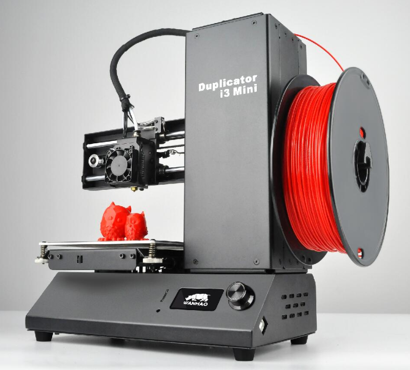

#About

The Wanhao Duplicator I3 Mini is an excellent entry level printer for beginners. This printer comes entirely assembled and will easily fit on your desk due to it's small size.

#Specifications

|Specifications| Duplicator I3 Mini
|-|-|
|Printing Technology| – FDM
|Build Volume| – 120 x 135 x 100mm
|Chassis Size (Desk Space Required)| – 300 x 382 x 370mm
|Filament Diameter Compatibility| – 1.75mm
|Extruder Style| – Bowden Style
|Stock Nozzle| – [0.4mm E3D Nozzle](https://www.diyelectronics.co.za/store/e3d-range/210-04mm-nozzle-for-3mm-all-metal-hotend.html) (3mm Input)
|Stock Hotend Assembly| – Custom E3D V6 3mm Hotend
|Maximum Hotend Temperature| – 260°C
|Print Platform Style| – Non-Heated / Wanhao Adhesive Sheet
|Printing Speed (Stable)| – 30mm/s
|Printing Speed (Max)| – 80mm/s
|Layer Height (Resolution)| – 0.1 to 0.4mm
|Motherboard / Primary Controller| – i3 Mini V1.1 Control Board
|User Interface| – Onboard LCD with Rotary Encoder
|Slicing Software Compatibility| – Cura / Simplify3D / Slic3r / Repetier Host
|File Format Compatibility| – STL / OBJ
|File Transfer Method| – SD Card / USB
|Bed Levelling System| – Manual
|Filament Quick-Change Function| – Manual
|Chassis Materials| – Black Powder-Coated Steel
|Included Slicing Software| – Wanhao Cura (Custom Wanhao Edition)
|Included 3D Printing Filament| – 200g Spool of PLA
|Distinct Features| – Excellent Beginner 3D Printer
|Weight (Printer)| – 7kg
|Weight (Package)| – 10kg
|Operating Voltage| – 24V DC
|Power Supply Input| – 100V/240V AC, 50/60Hz
|Power Supply Output| – 24V 2A 50W | LRS-50-24

#User Manual
* [ Wanhao I3 Mini User manual](pdfWanMini.pdf)

* This manual is to help you adjust your limit switch for the Z-Axis  [How to adjust height of Z-Axis Limit Switch](How_to_adjust_the_height_of_your_Z-Axis_Limit_Switch.pdf)

#Tips to the I3 Mini

###Getting print to stick

* Since the I3 mini doesn't come with a heated bed it becomes a lot harder to get your print to stick to the bed. But do not fear, DIY is here.
    * The first step is to ensure your bed is level, this is the most important factor to getting your print to stick to the bed.
    
    * The next important factor is how far your nozzle is from the bed. When your nozzle is extruding you want the plastic to "squish" down to the bed, if your nozzle is too high you're just printing in mid-air.
      The best way to adjust this is in your Simplify3D G-Code settings. Change your Z-axis G-code offset to adjust the height of the nozzle. Only make small adjustments of +0.05mm/-0.05mm, adjusting too much could
       cause your nozzle to scrape the print bed.
       
    * If you have done the above and you are still having issues try slowing down your print for the first layer, this gives your print more time to bind to the bed.
    
    * Temperature has a large effect on the ability of your print to stick to the bed. If your print cools too quickly it may pull away from the bed and unstick.
        Warm up your first layer a little higher than the rest of your print. Ensure your printer isn't exposed to any drafts or extreme cold conditions.
    
    * If you still struggling you can use tapes and glues, there are also special adhesives available for 3D printing to aid you.