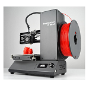
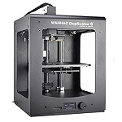
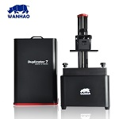
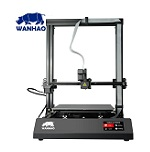

#Background

Wanhao has been one of the biggest competitors in the 3D printer industry since 2011 and it is easy to see why. 
Wanhao printers are a large favourite amongst hobbyist due to it's ease of use and quality prints.

 
#3D Printers

 [Wanhao I3 Mini](WanI3mini.md)  
 [Wanhao D6](WanDup6.md)  
 [Wanhao D6 Plus](WanDup6plus.md)  
 [Wanhao D7](wanD7.md)  
 [Wanhao D7 plus](wanD7plus.md)  
 [Wanhao D9](WanD9.md)  