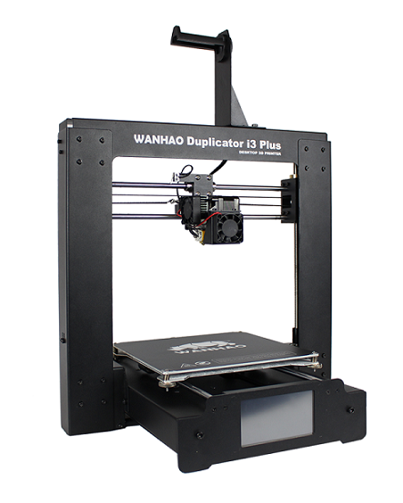

#About

The Wanhao Duplicator I3 plus equipped with a heated bed plate and a wanhao Adhesive Sheet, is the upgrade from the Wanhao i3 V2. 

#Specifications
|||
|-|-|
|Print Technology| Fused Filament Fabrication (FFF)|
|Build Volume| 200 x 200 x 180mm|
|Layer Resolution| 0.1 – 0.4mm|
|Extruder Quantity| Single Extruder|
|Nozzle Diameter| 0.4mm|
|Print Speed| 10mm/s - 70mm/s|
|Supported Print Materials| WANHAO Branded PLA, ABS, PVA, HIPS, Wood, Flex, Conductive
|Operational Extruder Temperature| 170°C - 240°C|
|Slicer Software| Cura Wanhao Edition 15.04|
|Cura Input Formats| .STL, .OBJ, .DAE, .AMF|
|Connectivity| SD Card, USB port (Expert users only)|
|Input Rating| 100-240V AC, 50/60Hz, 3.5A|
|Printer Frame Dimensions| 400 x 410 x 400mm|

#User Manual
* [I3 plus Wanhao User manual](I3 plus Wanhao manual.pdf)