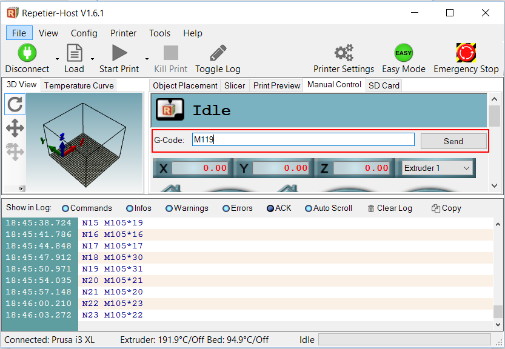
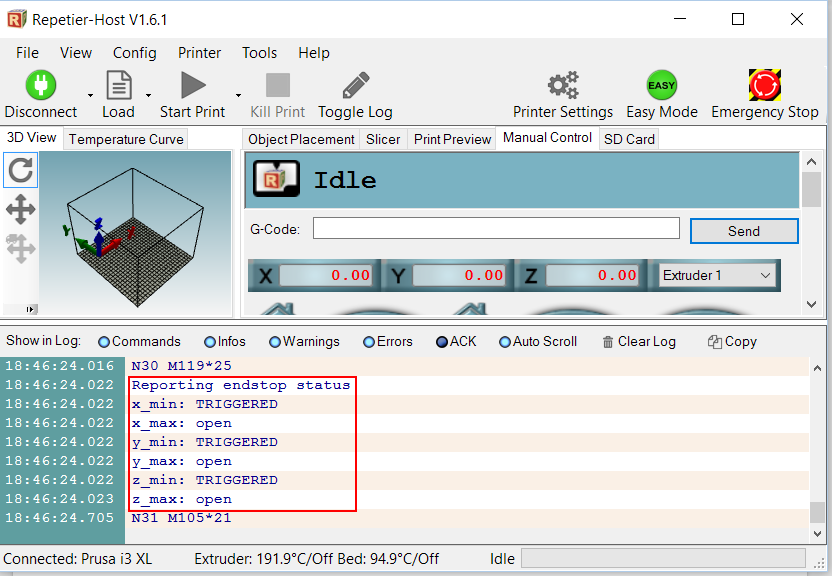
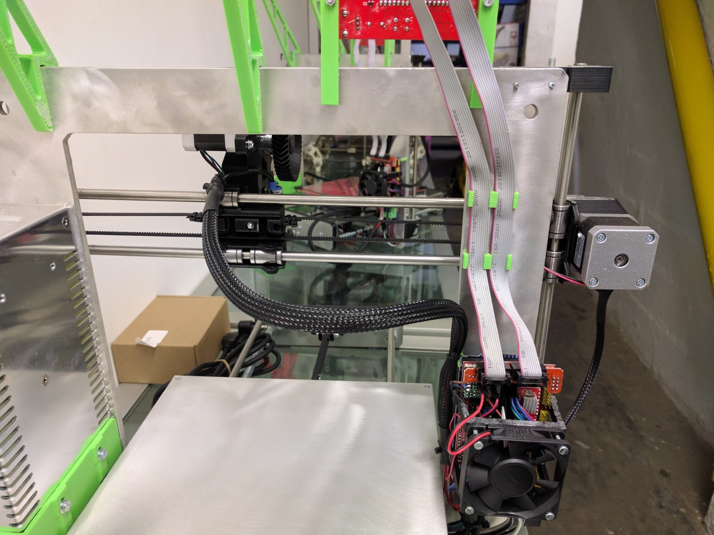

##What is 3d printing?

3D printing is the process of making three dimensional objects from various materials.
3d printing uses digital files such as STL files to produce a 3D object.
3D printing ranges from small scale home use to large scale manufacturing and even biological applications.

##How much does it cost to 3d print?

Cost of 3d printed objects ranges greatly depending on the size of the print, the density and the amount of supports, but an easy way to estimate the value of a print is shown in the equation below:

Cost to Print = Weight of Model X (Cost of Spool/Full Spool Weight)

##What is your personal favourite 3d printer and why?

DIYElectronics Prusa i3 Premium, since it is based on the original Prusa i3, it is one of the most common and well supported printers on the market. 
It has a fantastic user base and many compatible parts or modifications available. For bigger print volume the Creality CR-10S is highly recommended.
 
##If I want to print quickly, what printer should I use?

The quickest printer to get setup with is either the Creality CR-10S or the Wanhao D6. 

##If I want to print the best quality, what printer should I use?

The DIYElectronics Prusa i3 Premium has a great potential for awesome print quality, followed by the CR-10S and the Anycubic i3 Mega Ultrabase. 

##What is the best value for money printer?

DIYElectronics Prusa i3 Premium for users that are willing to spend time fine tuning and tweaking their printer. CR-10S for large print volume and good print quality with minimal fuss. 

##Where can I find files to print?
There are many websites online that provide free STL files for 3d printing, many 3d makers upload their designs for free for public use. 
Websites such as thingiverse.com and Grabcad.com are a great place to start as well as stlfinder.com

##What kinds of filament are there?

There are MANY filaments available for hobby and professional printing.
 The two main types used by most makers are PLA and ABS. However, there are many other exotic filaments to meet your needs, including nylon, wood, polycarbonate, HIPS (High impact Polystyrene), PETG (Polyethylene Terephthalate), and various soft or flexible filaments such as TPE or TPU. There are also many other exotic filaments out there and modified filaments with filler materials such as metal powders.
 
##What factors affect length of time to print?

•Print length time depends on largely on the size of your print as well as infill level. 
Larger prints with large infill settings will take a longer time to print. 
Print speed can also affect the time taken to print, however faster print speeds often leads to imperfect prints. 
The more detailed a print is the longer it will take. 
Additionally the print time (and quality) is affected by nozzle diameter, with a smaller nozzle taking longer to print but producing better results.

##What factors effect plastic extrusion?

Plastic extrusion quality is generally a function of print temperature and print speed. This does rely on excellent quality plastic and a well setup hotend. Further, quality is dependent on the quality of the nozzle. 
11.	What is the most effective way to get a print to stick to the bed?
This is one of the biggest challenges of the FDM 3D printing technology, and the particular method depends mostly on the type of plastic being printed. In general a heated print bed fitted with a Buildtak or PEI print surface is the best general purpose option. 

##Why is my print not printing?

This is a very difficult question to answer specifically as many factors can cause your print to not work. If it is your first print, ensure your printer is set up correctly, you have sliced your file correctly and filament is extruding. However if your printer is suddenly not printing after multiple uses there are a number of other factors that could be affecting this. 
Firstly ensure your printer nozzle is not blocked by either pushing some filament through at the correct temperature or by heating up the hotend and pushing a needle through.
If you are sure your nozzle is not blocked ensure your nozzle is not too close to the bed as this will prevent the plastic from extruding, you can do this by positively increasing the Z-axis offset to raise the nozzle. Alternatively, if your printer allows it, lower the print bed.

##What do I do if my filament snaps or strips?

Older filaments are more likely to snap. However sometimes your brand-new filament might snap too. 
Check your idler tensioner to ensure it is not too tight, alternatively check the temperature and flow rate of the hot end as these settings could cause tension the filament causing it to snap. 
Older filament tends to absorb moisture from the air and can cause it to become brittle (especially PLA). 
Sometimes filament can be dried at a low temperature in and oven for a few hours, to recover its properties. 

##What tips do you have when printing with supports?

Download some support test files and fine tune your support settings. 
Make sure your support generation is not too dense or too sparse and ensure the separation layers are correct to make sure the supports break off well from the prints. 

##What tips do you have when printing a large print?

Large prints tend to warp, especially with high shrinkage plastics like ABS. 
An enclosure for your printer will prevent cold air drafts and keep the area around the prints at a higher ambient temperature. 
Also make sure your printer is well maintained and on a good power supply, as losing a print after many hours of printing is not a joyful experience! 
Printing from SD card can prevent issues with USB cables and PC sleep modes during long prints. 

##What tips do you have when printing a small print?

Make sure you have your extruder calibration dialed in, i.e. not over/under extruding. 
Try use a smaller nozzle 0.4mm or smaller to improve print quality. 
Use the ‘raft’ generation function in your slicer if your part has a small contact area with the bed, to prevent small parts detaching from the bed. 

##What causes first layer messiness?

This is often due to the print bed not being level or the nozzle being too far away from the print bed.
If you are sure your nozzle height is correct, and your bed is level try decreasing the print bed by 5°C repeatedly until adhesion is better.

##Why is my print bowing out at the bottom?

•This is mostly due to the weight of the rest of the print pushing down on lower layers. 
This is a tricky one to fix as it involved tweaking the temperature and cooling of the print. 
Your bottom layer needs to be cooled sufficiently before the next layer is added, however too much cooling can also lead to warping of your print. 
Try lowering the print bed temperature by 5°C and if you have a part cooling fan try setting it to start at a lower height. 
Bowing can also be fixed by raising the nozzle height and leveling the print bed accurately.

##What causes warping of prints?

Warping is often caused by the printed part being cooled too quickly, causing the plastic to shrink slightly. 
The best fix for this is using a heated print bed, tweaking the temperature setting of the hotbed may reduce warping. 
Other quick fixes include decreasing nozzle height to ensure the print stick to the bed or using different adhesives on the print bed.
A print enclosure makes a massive difference here also. 

##Incomplete infill or gaps between outer wall and infill?

Infill problems are due to incorrect settings in your slicing software. 
20% is a standard value used for infill settings, less than 20% can cause weak infill. 
Larger prints may require larger infill percentage to increase hardiness of the print. 
If there are gaps between the infill and outer wall increase your Infill Overlap. 
Lowering your print speed may also reduce the gap between wall and infill.

##What causes cracks in print?

Cracks are caused by lack of adhesion between layers. 
Often this happens in larger prints as higher layers are not as affected by the print bed temperature. 
If you have a part cooling fan, try reducing its speed and aiming it at your 3d object. 
You can also try increasing your extruder temperature for higher layers to ensure the plastic is adequately heated.

##How do I fix messy overhangs?

Messy overhangs happen when a printer tries to print on a layer that is not there. 
A 3d printer is unable to print a part in midair. The most effective way to reduce overhangs is to use supports. 
Most softwares come with automatic support generation, alternatively you can create your own support in your design.

##What causes ripples in my print?

Ripples and bumps are often due to vibration of your 3D printer, ensure your bearings still run smoothly and all bots are tight, you can also oil your rods to ensure a smoother flow. Slowing down the print speed can also help reduce random bumps in your print. If there is many bumps or droopy parts, this may be due to overextrution.

##X / Y / Z / Extruder Axis Runs in Reverse

The motor axis is reversed, the easiest way to solve this issue is (with everything powered down) to flip the motor plug on the RAMPS board 180 degrees. This will reverse the axis in question:

##Endstops Do Not Work Correctly

First make sure the axis are all moving in the correct direction. 
Next in Repetier Host send the M119 command in the G-Code command line.

Note the response in the text log: 

When the endstops are not pressed they should read as Open
You can hold an endstop down and then send M119, it should then read Triggered if it is working properly. If you do not have this response then check that the endstop is plugged into the correct port and that the wiring is not damaged. 
Ignore the Max endstops, we only use the Min endstops. 
Also check that the X endstop relates to x_min and the same for Y and Z with the M119 command. If not then they are connected to the wrong locations.

##One of the Axis Does Not Work

The first thing to try is (with the power off) swap one of the working axis stepper motor drivers with the driver on the axis that doesn't work. Test again, then we will know if the driver is faulty or if there is a different problem.

##Rough Layers in Prints

The attached picture shows how A , C and D layers are very rough and layers 
B are smooth. This seems to occur at the same levels in each of the models 
we printed.
Some are worse than others.

Solution:
Generally this problem is a function of three variables: 
Temperature too high, try reduce 5 - 10 'C
Flow rate too high, try reduce 5 - 10% or check that extruder calibration is spot on
Print speed is too high, slow down the print a little. 
Try tweak one of those variables at a time and see if you can get it printing smoothly.
Over and above those factors some filaments can be more prone to this problem than others, try printing in a different colour and see if it helps. 
Finally one of the biggest causes of this problem is related to the nozzle size, slicer and slicer settings. You may see an improvement by using a better slicer like Simplify 3D, using a smaller nozzle size, changing your layer size and adjusting the extrusion width over height factor. The layer height can also play a roll. 

Essentially it is a case of fine tuning, but once you get it right the prints will come out perfect. 

##Prusa i3 Cable Management

Cable management on your Prusa i3 kit, or any 3D printer kit, is very important in order to prevent failed prints and other cable related issues. The following guide is intended to assist with cable management on your printer. 

On the extruder, gather all cables together just above the X-carriage. Small cable-ties are useful here.

Bring the cables through the frame and down towards the RAMPS board top left corner.

Secure the extruder wiring to the top left RAMPS mounting screw with a small cable-tie.

Bring the extruder wiring bundle down to the lower left RAMPS mount and secure. Trim the red hot-end heater cable to length and insert into heater screw terminals. Bunch excess thermistor and stepper motor cable under the Arduino board. Connect Thermistor, Extruder Stepper, Hot-End Fan and (optional) Auto-Level Sensor Cables to the RAMPS board and reinstall the RAMPS fan. 

##How to adjust first layer using "Marlin Baby Stepping"

- Start print 
- Under "tune" in the main menu select "Babystepping Z"
- Turn the dial anti-clockwise to lower the nozzle closer to the print surface 
- You will have achieved the ideal nozzle position for your first layer once the filament is being lightly squashed against the print surface creating an even bead of extrusion.

##The Heated Bed Struggles to Reach 100'C or More

That's quite normal, we suggest printing ABS at 80-90'C bed temp, we find that is ideal with our aluminium build plate and ABS / Acetone solution. 

Additionally it is possible to get to 110'C if you insulate the bottom of the bed. Using an enclosure helps too. 
We find this is a bit hot for printing directly to the aluminium bed with ABS, rather this bed temp is suitable for print surfaces such as PEI. 

##Editing your G-Code / Start / End G-Code etc

G-Code is the language that is used by your printer electronics to control the printer. The slicing program / toolchain such as Slic3r or Simplify3D generates this G-Code automatically and saves it to a text based .gcode file that is then sent to your 3D printer either over a serial connection, SD card or network. 

Check out the following link for some tips on setting up the some of the configurable sections of the G-Code generation in order to fine tune your 3D printers operation: 
http://wiki.solidoodle.com/setting-and-editing-your-gcode

