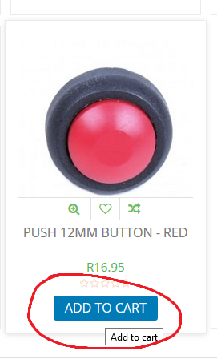
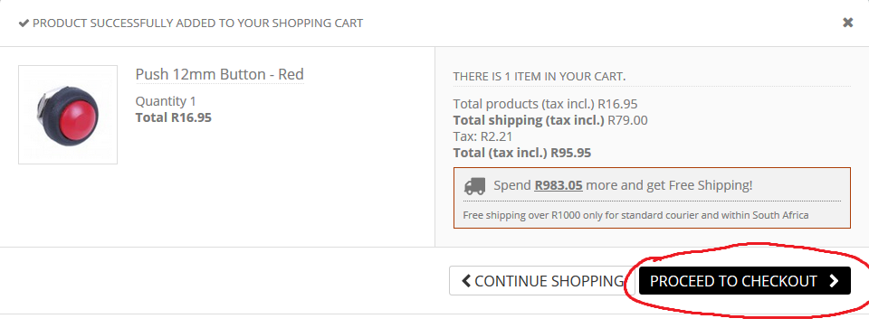
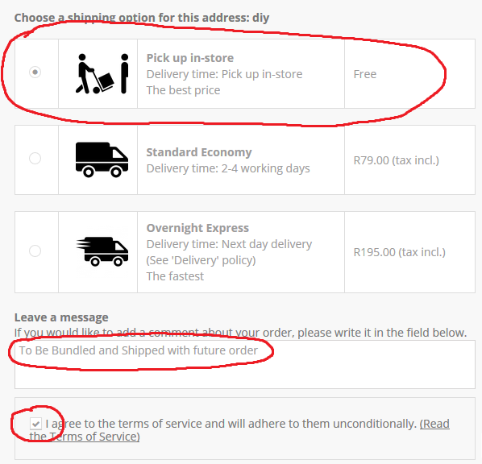
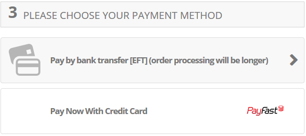
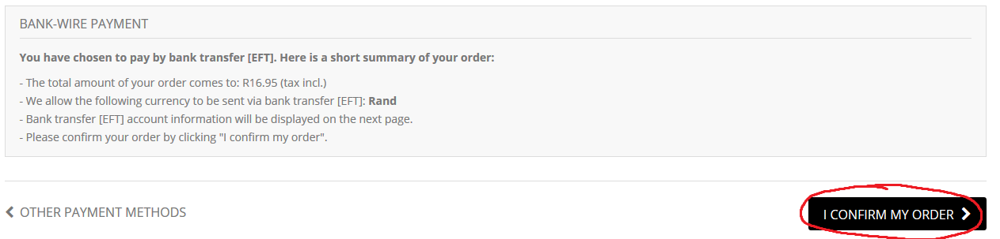
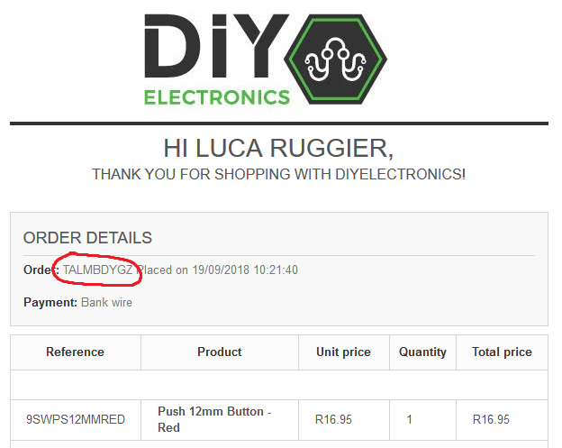
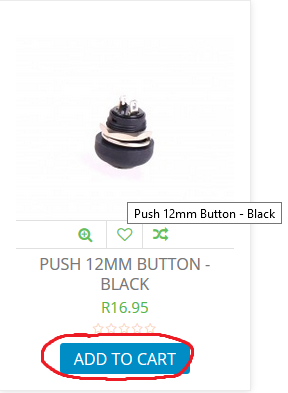
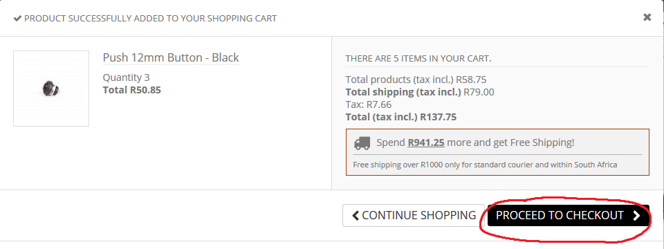
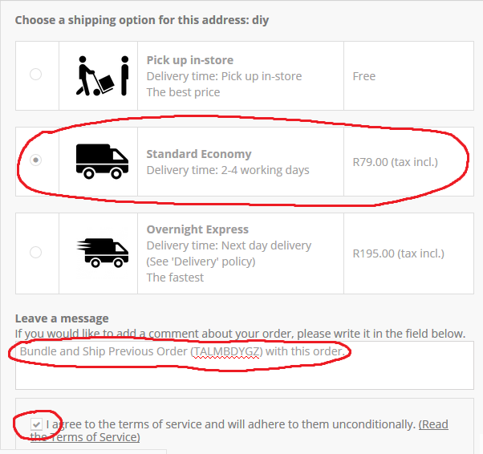
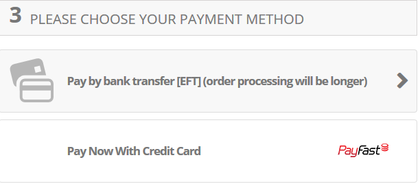

#How to place an order when waiting for particular stock

To secure products that are currently in stock, while you wait for something else to come into stock.
For example purposes, the item current in stock is a red button, and the item that we are
waiting to become available is a black button.

<b>Firstly, you will need to order and pay for the item, and instruct us to hold onto your order until the new item comes into stock.
To do this, follow the steps and instructions below.</b> 

1. Add the item to your cart.

2. Scroll down, Select "Pickup in-Store", Leave a comment saying "To Be Bundled and Shipped with Future Order", and agree to the T's and C's. 

3. Scroll down further, select your payment method, and pay! 

4. You should recieve an email from us, with your Order Number, SAVE THIS!! 

When the second item is now in stock (The black button in this example), you will need to pay for the item and specify that it is to be shipped with your
previous order.

To do this, follow the steps and instructions below. 

1. Add the item to your cart.

2. Scroll down, Select "Standard Economy", Leave a comment saying "To Be Bundled and Shipped with Previous order [ORDER NUMBER]", inserting that order
number that you were emailed, and agree to the T's and C's. 

3. Now pay for this item, and you are done! Both products will be shipped to you! 
