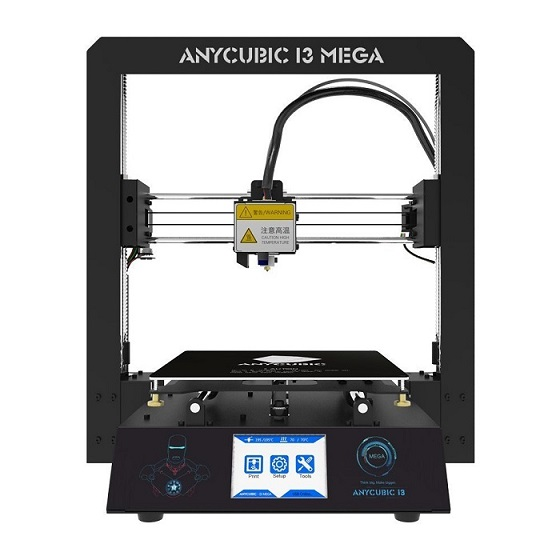

#About

This extremely simple to assemble printer is designed for easy prints. Its rigid metal frame gives it stability to improve print accuracy.
The 3.5-inch TFT Touch screen supports multilanguage custom and comes with one click "resume print" incase of power outages.

#Specifications
|Specs|Value
|-|-|
|Nozzle Diameter| 0.4mm  
|Filament Diameter| 0.175mm    
|Hot Bed Temperature| 100°C
|System| Windows, Linux, Mac  
|Power Supply| 240V  
|Print Speed| 20-100mm/s  
|Layer Thickness| 0.1-0.4mm  
|SD-Card Support| yes  
|Max. Resolution| 0.1mm   
|Printing Software| Cura   
|Z Axis Positioning Accuracy| 0.002mm    
|XY Axis Positioning Accuracy| 0.010mm  
|Language| English   

#User guide

The video below explains step by step how to assemble your Anycubic I3 mega.

