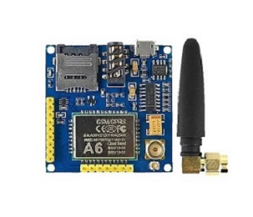

#GOOUUU TECH A6 GSM/GPRS DEV BOARD MODULE WITH ANTENNA

The A6 Module is a professional serial GSM/GPRS development board. The A6 supports GPRS and SMS data transmission.
The A6 communicates with microcontroller via UART port.

#User Guide

When connecting your A6 to your TTL module, follow the following table to guide you with correct wiring.

|TTL Module| A6 GSM Module|
|-|-|
|VCC| EN
|GND| GND
|RX|U_TXD
|TX|U_RXD

To power your module use the micro USB port on the A6 board. 
When connecting your board for serial communication, use a Baudrate of 115200.