<h1 align="center">ALPHABOT BUILD GUIDE</h1>

|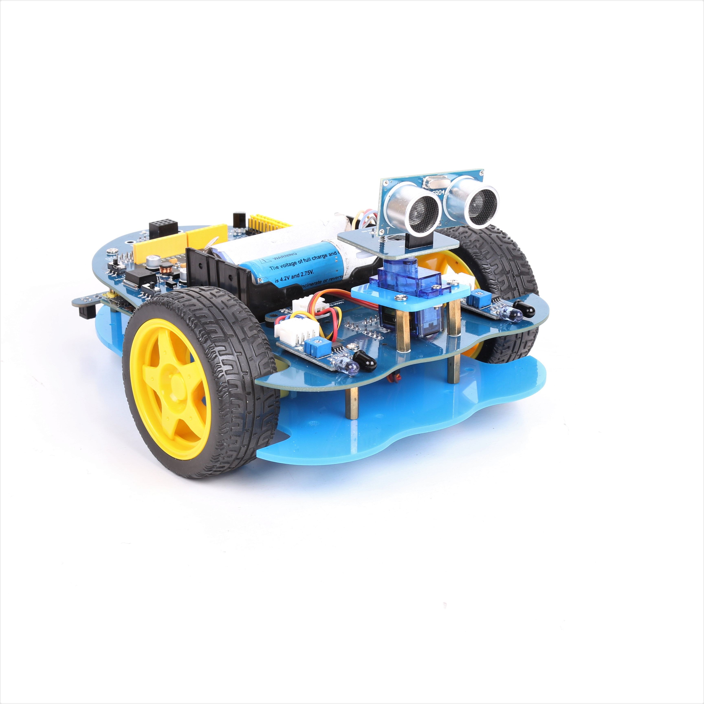 |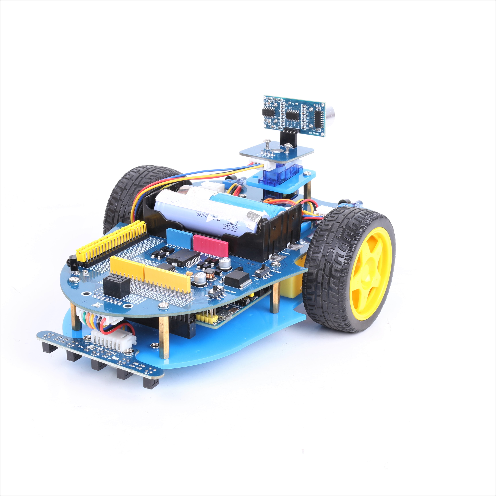
|-|-|

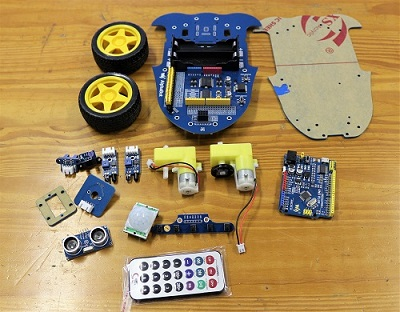

<b>STEP 1:</b> First and foremost you should connect your Arduino to the Arduino slot on the Alphabot board, as shown in the image below.

|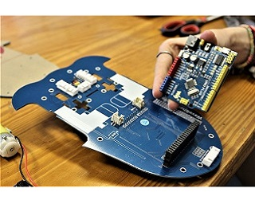 |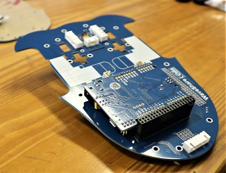
|-|-|

<b>STEP 2:</b> Attach corresponding cables to their module as shown in the table and picture below.
 
|Module| Wire Number|
|-|-|
| Speed Measuing interface| 3 Wires x 2|
| Obstacle avoidance interface| 4 Wires x 2|
| Tracker Sensor| 7 Wires x1|
| Ultrasonic mount| 4 Wires x1|
  
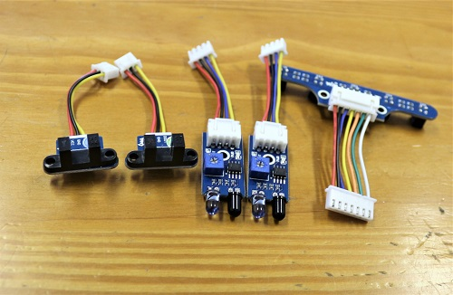

<b>STEP 3:</b> Attach the ultrasonic sensor to the ultrasonic board as shown in the image below.

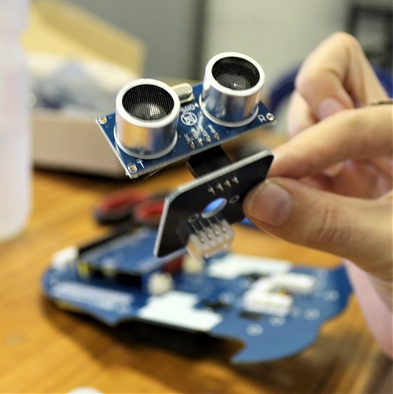

<b>STEP 4:</b> The servo slots into the remaining plastic mount as shown below. Clip on the plastic servo horn that comes with your servo, onto the top of the servo.

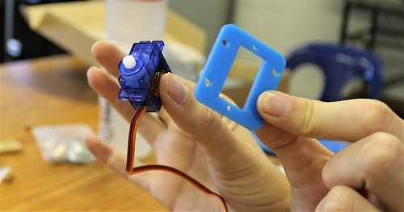

<b>STEP 5:</b> Attach the obstacle interface board to the corresponding pins found at the bottom front of the Alpha board (5v, GND, AR/LR, DR/DL).

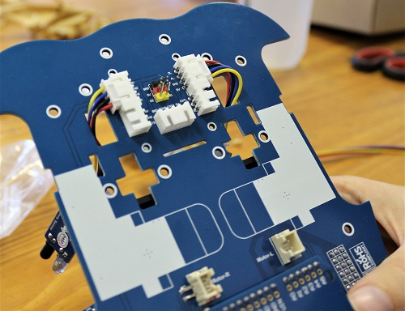

<b>STEP 6:</b> Next you want to connect the speed measuring inerfaces to the pins just below those of the obstacle interface on the Alpha board (5V, GND, CNTR/CNTL)

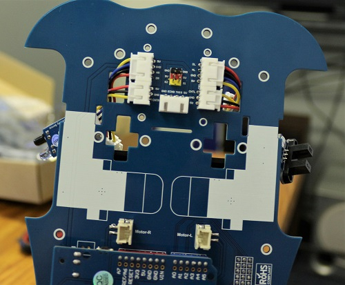

<b>STEP 7:</b> Attach the tracker sensor to the back of the robot.

<b>STEP 8:</b> The alphabot comes with 3 different sizes of spacers, as shown below. Attach the smallest spacers to the plastic mount you linked your servo with.
 Following this you can attach the servo and its mount to the Alphabot board.

|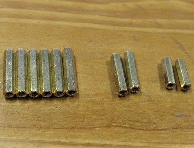| 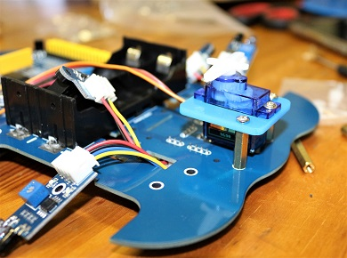|
|-|-|

<b>STEP 9:</b> Attached ultrasonic sensor module to its corresponding mount/board as shown and attach to the servo.

|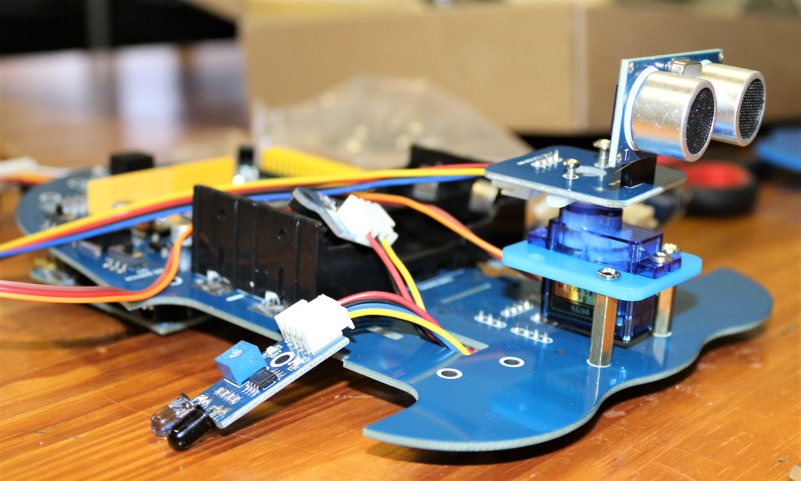| 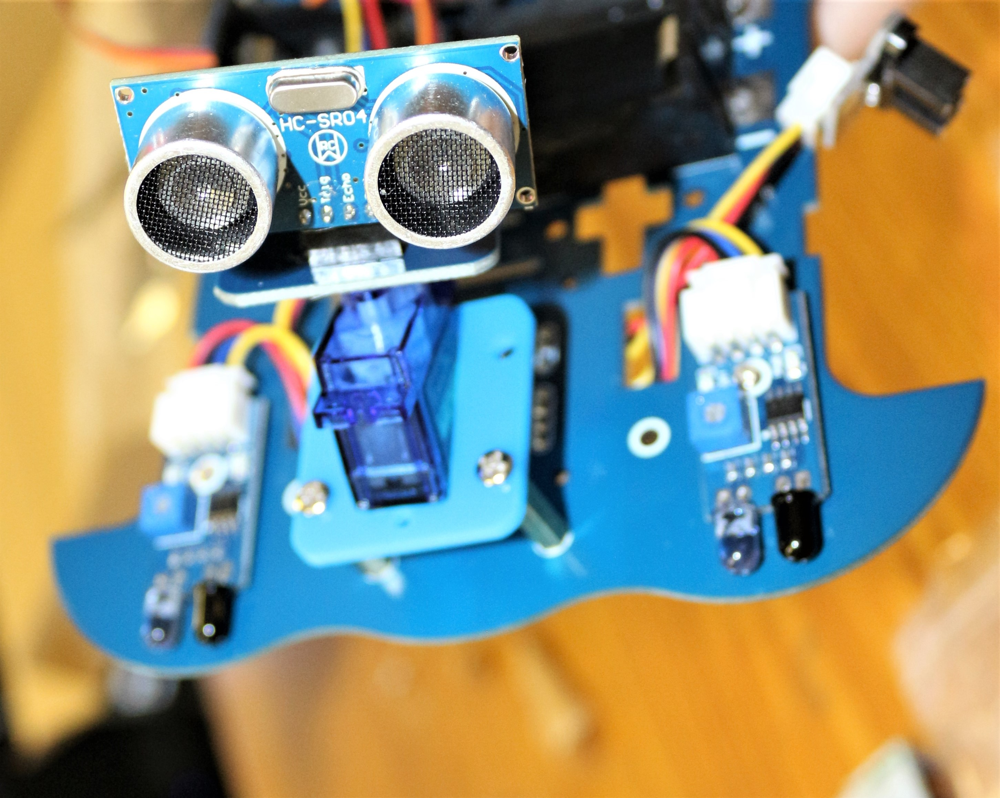|
|-|-|

<b>STEP 10:</b> Attach the two yellow wheel motors to the two Motor slots on the bottom of the Alphaboard, as shown. You will be using the 4 T shapped plastic mounts to hold the motor in place.

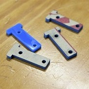 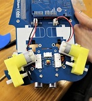  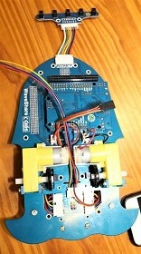

<b>STEP 11:</b> Attach the obstacle avoidance sensors to the end holes of the front side and the servo wires to the 3 pins in the middle. (GND(brown), 5V(red), S1(orange))

<b>STEP 12:</b> Slot the speed monitoring sensors (encoder) in the holes next to the battery holder, these holes might be a little bit tight,
 but don't worry, you can use a file to make them a little bit bigger.
 
<b> In the image below, the red circle shows the speed monitoring sensor and the green shows the obstacle avoidance sensors.</b>

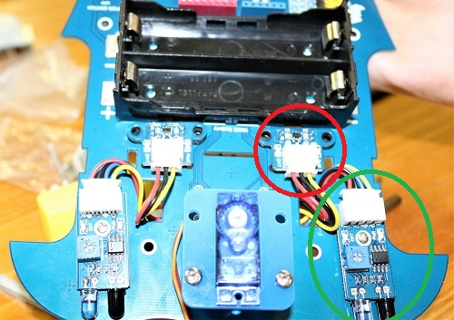

<b>STEP 13:</b> Attach wheels to the motors.

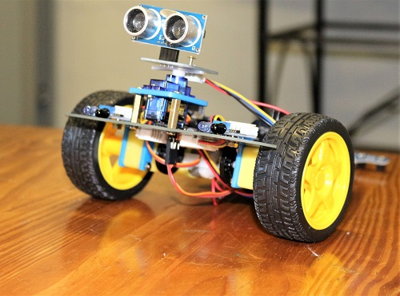

<b>STEP 14:</b> Connect rolling metal wheel to stand alone Alphaboard at the bottom as shown.

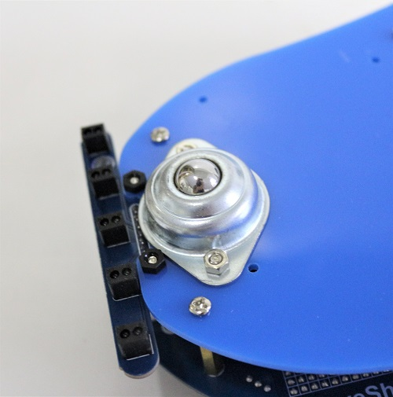

<b>STEP 15:</b> Connect largest spacers to your bottom standalone Alphabot board, make sure you have at least 6 spacers spread across the board.

<b>STEP 16:</b> Connect tracker sensor to bottom stand alone body piece.

<b> STEP 17:</b>LASTLY! Connect stand alone body to Arduino body at spacer sites.

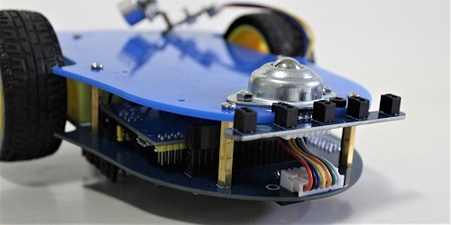