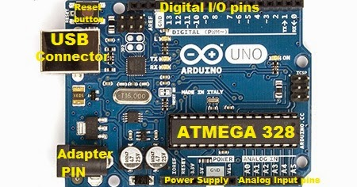
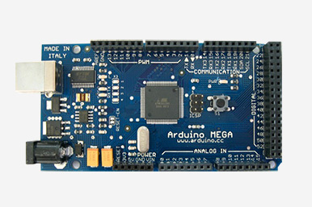

#Arduino 101 Intro

The first thing that you need to know about Arduino is what board do you use? Sure you could use a Mega or and Uno for a range of tasks,
but you should also know what is the minimum requirements of your board to perform a certain task you have in mind.
So let's look at the available boards and their capabilities:

#Arduino Uno (R3)

The Arduino Uno R3 comes with an ATmega16U2 which in noob terms compared to older versions, the board is now cable of faster transfer rates
and contains more memory.

__Pins:__ 14 digital input/output pins (of which 6 can be used as PWM output).
      6 analog inputs.
      
__Microcontroller__: ATmega328

__Operating Voltage__: 5V

__Input Voltage (recommended)__: 7-12V

__Input Voltage (limits)__: 6-20V

__DC Current per I/O Pin:__ 40 mA

__DC Current for 3.3V Pin:__ 50 mA

__Flash Memory:__ 32 KB of which 0.5 KB used by bootloader

__SRAM:__ 2 KB (ATmega328)

__EEPROM:__ 1 KB (ATmega328)

__Clock Speed:__ 16 MHz

#Arduino Mega 2560 (R3)

This version of the mega comes with a ATmega16U2 to replace the previous 8U2.

__Pins:__ 54 digital input/output pins (of which 14 provide PWM output)
      16 analog inputs
      
__Microcontroller:__ ATmega2560

__Operating Voltage:__ 5V

__Input Voltage:__ (recommended) 7-12V

__Input Voltage:__ (limits) 6-20V

__DC Current per I/O Pin:__ 40 mA

__DC Current for 3.3V Pin:__ 50 mA

__Flash Memory:__ 256 KB of which 8 KB used by bootloader

__SRAM:__ 8 KB

__EEPROM:__ 4 KB

__Clock Speed:__ 16 MHz

#Arduino Pro Mini 328

These boards are a minimalistic design for an Arduino board. These boards come in two versions 5V/16MHz or the 3.3V/8MHz. This board although
it looks small and not intimidating it is not for the first time Arduino user, this board is designed for makers looking for a small sized board.
These boards do not come with connectors attached but rather allows the user to solder on their own connectors or wires as they please.

__Pins:__ 14 digital input/output pins (of which 6 can be used as PWM output).
      6 analog inputs.
      
__Microcontroller:__ ATmega328

__Operating Voltage:__ 5V/3.3V
                    DC input 5V up to 12V

__DC Current per I/O Pin:__ 40 mA

__Flash Memory:__ 32KB of which 2 KB used by bootloader

__SRAM:__ 2 KB/ 1KB

__EEPROM:__ 1 KB/ 512 Bytes

#Testing your Arduino

Before jumping in to your chosen project for your Arduino, you should be sure your Arduino is fully functional.  
To do this all you will need to do is connect your Arduino via serial to your computer and upload the blink.ino to your board.  
You can find the blink.ino program within your Arduino IDE under Files -> Examples -> Basics -> Blink.  
When uploading the Blink program make sure you have selected the correct Port and upload speed under tools.
If you're Arduino is in working order and you have uploaded the code correctly you should see the on board LED of your Arduino flashing.

#Arduino Getting Started Links

- Basic references are provided by the Arduino foundation: [https://www.arduino.cc/](https://www.arduino.cc/)
- Programming references: [https://www.arduino.cc/en/Reference/HomePage](https://www.arduino.cc/en/Reference/HomePage)
- Getting started: [https://www.arduino.cc/en/Guide/HomePage](https://www.arduino.cc/en/Guide/HomePage)
- Program examples: [http://playground.arduino.cc/](http://playground.arduino.cc/)

