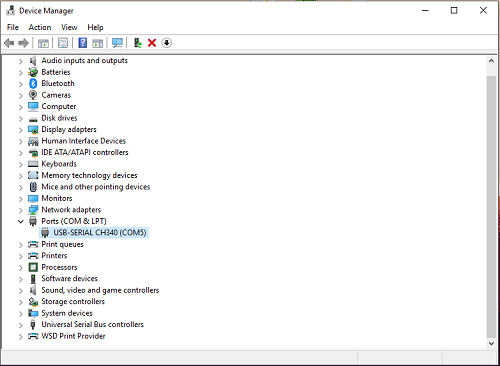
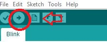

#Ensuring connection to your arduino compatible board 

###Step 1: Ensuring power connection.
   
* Ensure that your Arduino Board is plugged into your computer, and that **at least one** LED light on the Arduino board is lit.   
* If an LED is lit, **proceed to Step 2**.   
* If an LED is not lit, there may be a fault with either your USB port, USB cable, or Arduino board.    
* To troubleshoot this, try plugging the Arduino board to a **different USB port** on your computer, or try a **different USB** cable.   
* If these do not work, you may have a damaged Arduino Board. 
		
###Step 2: Ensuring communication between computer and Arduino Board. 

  

* Right-Click on your Start Menu Icon and Select **"Device Manager"**. A long list of devices should be displayed.  
* Look for the label **"Ports (COM & LPT)"** and click the drop down arrow. You should see at least one entry named **"USB-SERIAL CH340 (COMX)"**  
* If the USB-SERIAL entry is present, proceed to Step 3.  
* If the USB-SERIAL entry is not present. You may have a faulty USB cable, you do not have the **correct CH340 drivers installed**, or a damaged Arduino board.  
* To troubleshoot this, install the latest CH340 drivers [CH340 Drivers](Drivers/CH340Driver.zip) 
* After the driver installation, **disconnect and reconnect** the Arduino board, the USB-SERIAL entry should be present, if not try a different USB cable.  
* If this also does not work, you maybe have a damaged Arduino Board.  
		
###Step 3: Ensuring that the Arduino board is flashable.
  
* Open the Arduino IDE, Select `File -> Example -> 0.1 Basics -> Blink`. Next select `Tools -> Board` and select your Arduino Board.   
* Next select `Tools -> Port` and select the serial port. There should be only one port, labelled **"COMX"**.   
* Next press the **Right-Arrow** to upload the sketch to your Arduino. The Arduino IDE should have displayed **"Uploading Done."** 

* 
  
* If all the above has been completed, proceed to Step 4.
* If your Arduino IDE does not list the serial port, restart the Arduino IDE.
* If the Arduino IDE says **"Problem Uploading to Board"**, Unplug the Arduino Board, Restart the Arduino IDE, reconnect the Arduino Board and **restart Step 3**.
* If the problem persists, you may have a damaged Arduino Board.

###Step 4: Verifying that the sketch uploaded.  

* If an LED on your Arduino Board is flashing: **Congratulations! You have flashed an Arduino Board!**   
* If the Arduino Board is not flashing, your board may be damaged.  