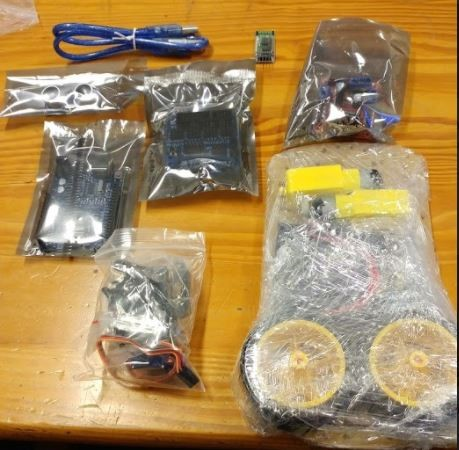
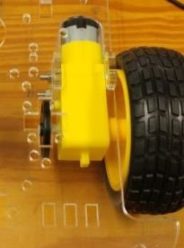
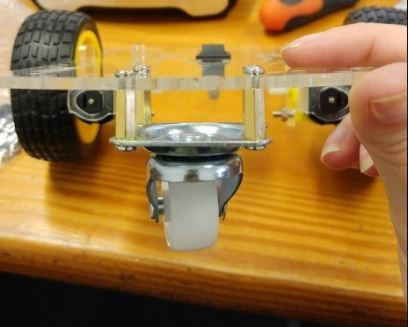
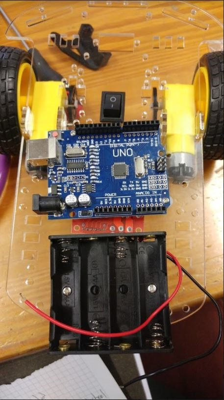
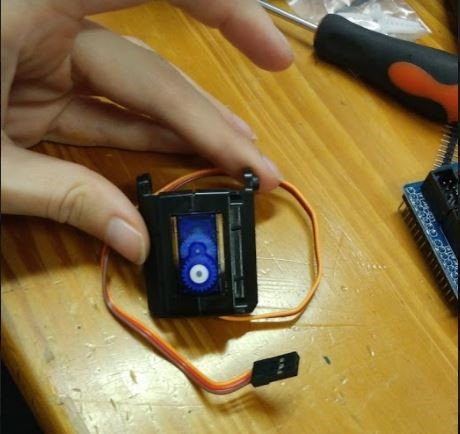
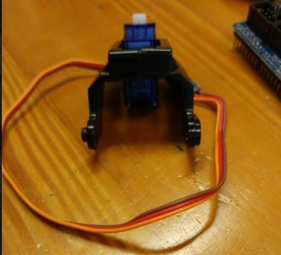
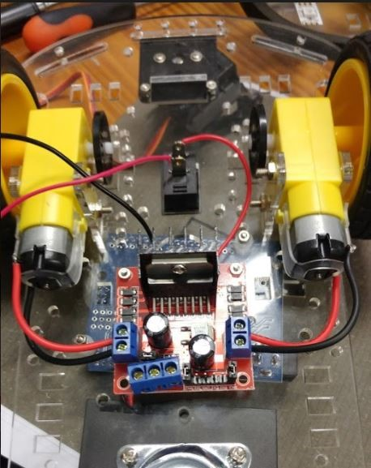
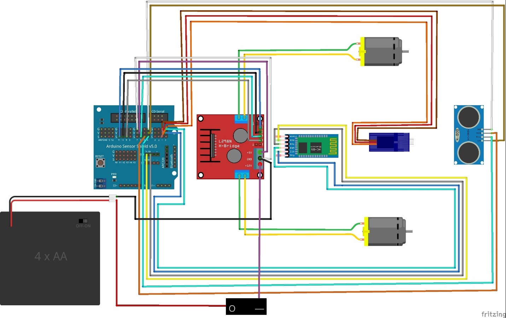

#Build guide to basic Arduino 2WD robot car

Everything you need to know to get you started on building your own Arduino 2WD robot car.

#Relevant links
[Get your very own robot car kit here](https://www.diyelectronics.co.za/store/robotic-kits/1155-2-wheel-drive-arduino-diy-robot-chassis-and-electronics-kit.html).

If you want to read about a noob's experience with building this car for the first time then follow this link!
[Robot cars: Because you're never too old for a remote controlled car.](https://www.diyelectronics.co.za/blog/2017/10/25/robot-car-building-because-youre-never-to-old-for-a-remote-control-car/)

##Parts list
|Components|	Quantity|
|-|-|
Arduino Sensor Shield v5.0 |	1
L298N Dual H-Bridge Motor Driver |	1
Arduino Uno Board	| 1
Servo Mounting Brackets |	1
Servo Motor (SG90)	| 1
Arduino USB Cable	| 1
HC-SR04 Sensor	| 1
DC Motors	| 2
2.51” Rubber Wheels	| 2
Acrylic Robot Chassis	| 1
Speed Encoders	| 2
DC 1.5V Battery Holder	| 1
Motor Blocks	| 4
ON-OFF Switch	| 1
Metal Ball Caster	| 1
Jumper Wire Set	| 1
Bluetooth Module	| 1
Brass standoffs	| 4

##Suggested Tools

* Needle nose pliers

* Wire cutters

* Soldering iron

* Screwdriver

##Build Guide

1.	First remove all the adhesive protection from the robot chassis and the motor blocks.

2.	Use two motor blocks per motor to install the motors on the bottom of the chassis using two long screws and two nuts each and attach the wheels.
    
    

3.	Clip the ON/OFF switch into the rectangular space in the middle of the chassis.

4.	Using the 4 Brass standoffs and eight screws attach the metal ball caster to the front bottom of the chassis.
    
    

5.	The best place to install the battery holder is the front of the chassis, however all components can be attached as you desire. Attach the battery holder using two screws and two nuts. (optional: add two plastic spacers to raise the battery holder off the chassis).

6.	Attach the motor driver to the bottom of the chassis in the middle. The motor driver only needs to be attached with two screws and two nuts.

7.	Attach the Arduino Uno board behind the battery holder and in front of the ON/OFF switch, using two screws and two nuts. (Optional: Add plastic spacers to raise Arduino from the chassis).
Suggested placements of the battery holder, Uno board and motor driver is shown in the image below.

    

8.	Next up, position the Servo Motor between the two brackets and screw them together as shown in the pictures below.
    
    || |
    |-|-|

9.	Attach the servo holder to the back of the chassis with two screws and two nuts. The motor can then be clipped in to servo holder.

10.	Next up is wiring your robot. Firstly, attach the red wire of the battery holder to the “O” part of the ON/OFF switch. This can be done by either hooking the wire on or soldering.

11.	Attach power and ground wires to the motor through soldering, and connect to motor driver correct connection spots as shown below.
    

12.	Now connect a power wire (red) to the “I” part of the switch and connect the other end to the first connection spot of the motor driver (Shown in the pink circle in the above image).

13.	Connect the black wire of the power holder to the second connection spot on the motor driver as well as another brown wire (Shown in the green circle in the image above). 

14.	Connect another wire from the third connection spot on the motor driver (Shown in yellow circle in the image above) and connect this wire to a Vcc pin on the Arduino shield.

15.	Connect the brown wire from the second connection spot to a ground pin on the Arduino shield.

16.	Place the Arduino Sensor Shield on top of the Arduino board. Ensure you connect the correct matching pins on either board.

17.	Using the jumper wires provided connect 4 to the HC-SR04. Colour coordinate your jumpers according to this guide to make your life easier. Connect the wires as shown in the image below.

18.	Connect the wires of your servo motor as shown in the image below.

19.	Lastly connect the motor driver pins to the Arduino Sensor Shield pins according to the image below.

20.	Next you will want to connect your Bluetooth module as well. Connect your TXD pin on your Bluetooth module to the RX pin on the Arduino Shield and your RXD pin to your TX pin as per the image below. Connect the VCC pin and GND pin to a V and G pin respectively on the Arduino Shield (at pin 0) as seen below.

21.	Starting code is provided which includes code to run your motors, link your Bluetooth module as well as primitive obstacle avoidance. You can use this code as your starting pointing to improving your robot’s obstacle maneuvering.

22.	Below is a table to show corresponding pin numbers to possibly make your life easier if you are a complete beginner. Pin locations are not set in stone, but will help you if you directly load our sample code without any changes. Below is also a diagram to help you see general wiring of your robot car.
    

    

You can also download a copy of our build guide [here](robot_build.docx).

#Code guide

Below is some base code for your robot car including obstacle avoidance.

* [Robot car obstacle avoidance code](BT_car_and_obstacle_avoidance.ino)

* [Robot car no obstacle avoidance](BTCarV2-no_servo.ino)

**Alternatively check out the link below for another build guide.**

[2WD robot build guide](ARDUINO_2WD_SMART_ROBOT_CAR.pdf)