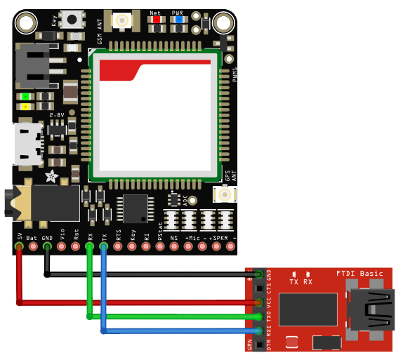

#Connecting to your GSM / GPRS Module!

###You will need:

* GSM / GPRS Module (Any module that accepts AT Commands)
* [FTDI TTL Serial Module](https://www.diyelectronics.co.za/store/serial/1460-ftdi-ft232r-usb-ttl-serial-breakout-module-programmer-ver2.html?)

###To Connect your Module to your FTDI TTL Serial Module

   

|GSM/GPRS|FTDI|
|-|-|
|VCC|VCC|
|GND|GND|
|RX|TX|
|TX|RX|

**Important!** If your GSM / GPRS Module has an *"EN"* pin, you must connect this to FTDI VCC as well.

Now plug in your FTDI module to your computer, launch your Arduino IDE, select the correct COM port by `Tools -> Port` and selecting the COM port, and open the Serial Monitor.
Set the baud rate to 9600.

###Communicating with your module
Using the following commands, you can determine whether or not your module is connected to a network!

| Command | Response | Description |
|-|-|-|
| AT |OK | Device is connected over Serial |
| AT+CPIN? | READY | Sim card is in and connected |
| AT+CREG? | +CREG: 1,1 | Device is registered on a GSM network |
| AT+COPS? | +COPS: 0,0,"MTN-SA" | Device is registered on the "MTN-SA" network |

If the Serial Monitor outputs random letters and symbols, try changing the baud rate to **19200**, **57600**, and **115200** and trying these commands again.