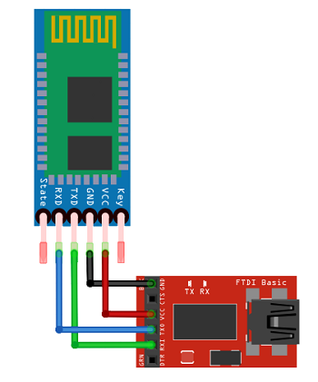

#Setting up your Bluetooth / BLE Module! 
**(HC-05/6 or JDY-08 / AT-09)**

###You will need:

* 1 x [Bluetooth Module (HC-05/6 or JDY-08 / AT-09)](https://www.diyelectronics.co.za/store/bluetooth/1441-jdy-08-cc2541-bluetooth-40-ble-serial-module.html)  
* 1 x [FTDI TTL Serial Module](https://www.diyelectronics.co.za/store/serial/1460-ftdi-ft232r-usb-ttl-serial-breakout-module-programmer-ver2.html?)

###To Connect your Bluetooth Module to the FTDI

|Bluetooth Module|	FTDI Board|
|-|-|
|VCC|			VCC|
|RX |			TX|
|TX	|			RX|
|GND|			GND|

###Guide to testing Bluetooth Module

* Upon plugging the FTDI into your computer, a red LED on the bluetooth module should start blinking.  

* Open your Arduino IDE, set your COM port to the COM port of the FTDI module, then open the Serial Monitor, and set the **baudrate to 115200**. 

* On your smartphone, open your bluetooth settings, and you should see a bluetooth device by the name of either, **"HC-05", "HC-06", "JDY-08", "AT-09"**, depending on
	the module you have.  
    
* **Pair with the module**, using one of the following pairing codes **"0000", "000000", "1234", "123456"**, as the pairing code varies between modules.  

* Once paired, download a **BLE Serial Communication App**, on Android, we recommend, **"Serial Bluetooth Terminal"**, on iOS, we recommend **"BluTerm"**.   

* Inside the Serial Communication App, you will need to connect to the bluetooth module, and the Red Blinking LED on the module should now be a **solid red** LED.  

* Type **"Test"** into the Serial Communication App, and **"Test"** should appear in the Serial Monitor.   

* If you see a strange output in the Serial Monitor, such as **`?f<#?"?怘⸮`**, change the baud rate to **9600, 115200, or 19200**, and send **"Test"** again, and there should be
 a correct output.  