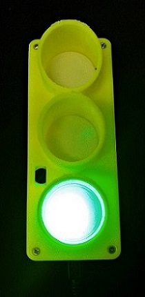
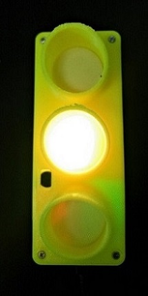
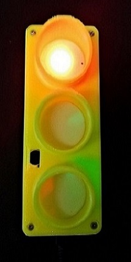
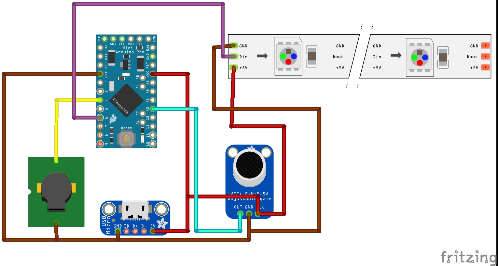
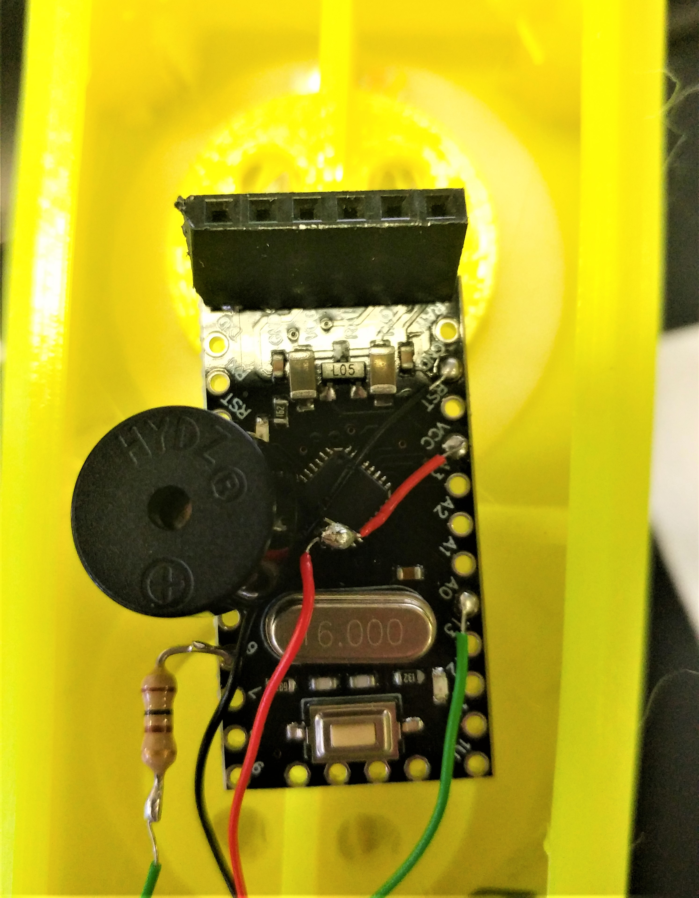
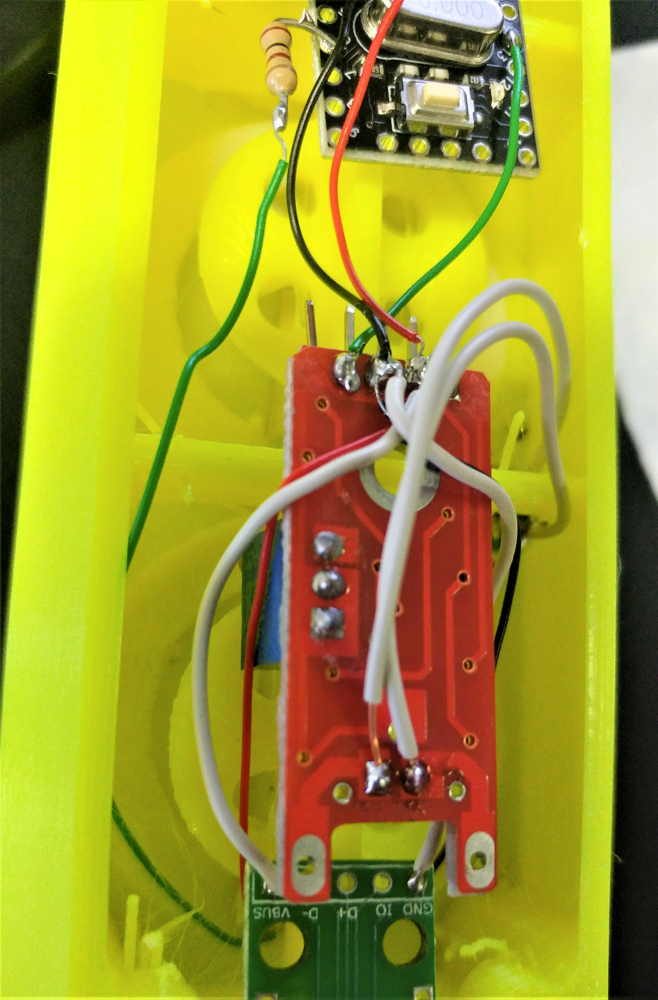

#Noise Traffic light
<b>([Original](https://www.instructables.com/id/Noise-Traffic-Light-DIY-3D-Printed/) design by Innovart Studio)</b>

We found this project during a casual scroll through [Instructables](Instructables.com) and we thought it would make a perfect addition to our office. The Noise Traffic light works by detecting the noise levels in the room and keeping a running average of them.
The traffic light remains green until a value exceeds the running average by a preset amount, it then switches to orange or red depending on how much higher the incoming value is.
This project is super simple and easy for even a beginner maker.

###Material

  
[Arduino Pro Mini](https://www.diyelectronics.co.za/store/boards/1501-arduino-pro-mini-v2-5v16mhz-328p.html)  
[Buzzer](https://www.diyelectronics.co.za/store/audio/1804-ky-012-active-buzzer-module.html?search_query=buzzer&results=18)  
[Neopixels](https://www.diyelectronics.co.za/store/led-strips/1846-ws2812b-rgb-led-strip-30m-5vdc-ip65.html?search_query=neopixel&results=6) x3  
[Microphone Module](https://www.diyelectronics.co.za/store/audio/627-microphone-sensor-module.html?search_query=microphone&results=11)  
[Wires](https://www.diyelectronics.co.za/store/connectors-wiring/1836-wire-wrapping-wire-30awg-8-colours-280meters.html)  
[Resistor](https://www.diyelectronics.co.za/store/resistors/1567-resistor-1k-ohm-14w-5.html)   
USB micro USB Breakout Board

Soldering iron  
Solder

##Diagram

##Instructions

1. Solder a wire to the VCC pin, the GND pin and pin A0 on your Pro Mini as shown in the image below.
2. Solder a wire to one end of your resistor and solder the resistor to pin 6 on your Pro Mini.
3. You can then solder your buzzer to pin 4 and GND pin.
   
   <b> The image above shows the connections for the GND, VCC, A0, 6 and 4 pins on the Pro Mini v2 Board</b>  
   
4. Solder the wires from step 1 to the corresponding VCC and GND pin on the micophone module.
5. Solder one wire to the GND pin on your Breakout Board and another to the VBUS pin.   
    You can then solder these wires to any point that connects to GND and VCC respectively. We connected our GND and VCC wires to the pins on our microphone board.
      
    <b> The image above shows wiring on the microphone module, note that VCC and GND wires from other modules can be soldered to the same spot</b>
    
6. Solder the wire from pin 6 on your Pro Mini to the signal pin on your neopixel strip (middle spot).
7. Solder the GND and VCC pin on the neopixels to corresponding pins on the Pro Mini. Again we connected our wires to the pins on the microphone board.
8. Layout your pixels in the front of your traffic light and place all modules behind this.

##Code

The original code comes from [Innovart Instructables page](https://www.instructables.com/id/Noise-Traffic-Light-DIY-3D-Printed/).  
We modified the code to include a running average to use as a base line.
If noise value is 3 bigger than the average the yellow light is activated, if the value is 8 bigger the red light and buzzer is activated.

[Traffic Light Noise Detector DOWNLOAD](Trafic_light_noise.ino)
~~~
#include <Adafruit_NeoPixel.h>
#define PIN 6
#define buzz 4
#define NUMPIXELS 3
#include "RunningAverage.h"

RunningAverage myRA(20);
int samples = 0;
int sensorValue, caseCount;
int Run_ave;
  Adafruit_NeoPixel pixels = Adafruit_NeoPixel(NUMPIXELS, PIN, NEO_GRB + NEO_KHZ800);
void setup () 
{
  Serial.begin (9600);
  pinMode(buzz, OUTPUT);
  digitalWrite(buzz, LOW);
  myRA.clear();
  pixels.begin();
}
void loop () 
{
  sensorValue = analogRead(A0);
  myRA.addValue(sensorValue);
  Run_ave = (myRA.getAverage());
  samples++;
  Serial.print("Running Average: ");
  Serial.println(Run_ave);
  Serial.println("Reading:");

  if (sensorValue > Run_ave + 8)
    {
      Serial.println(sensorValue);
      pixels.setPixelColor(0, pixels.Color(0,0,0));
      pixels.setPixelColor(1, pixels.Color(0,0,0));
      pixels.setPixelColor(2, pixels.Color(255,0,0));
      digitalWrite(buzz, HIGH);
      pixels.show();
      delay(1000);
    }
  else if (sensorValue > Run_ave + 3)
    {
      pixels.setPixelColor(0, pixels.Color(0,0,0));
      pixels.setPixelColor(1, pixels.Color(255,165,0));
      pixels.setPixelColor(2, pixels.Color(0,0,0));
      digitalWrite(buzz, LOW);
      pixels.show();
      delay(1500);
    }
   else {
    pixels.setPixelColor(0, pixels.Color(0,255,0));
    pixels.setPixelColor(1, pixels.Color(0,0,0));
    pixels.setPixelColor(2, pixels.Color(0,0,0));
    digitalWrite(buzz, LOW);
    pixels.show();
   }
  if (samples == 300)
  {
    samples = 0;
    myRA.clear();
  }
  delay(100);
  }
~~~