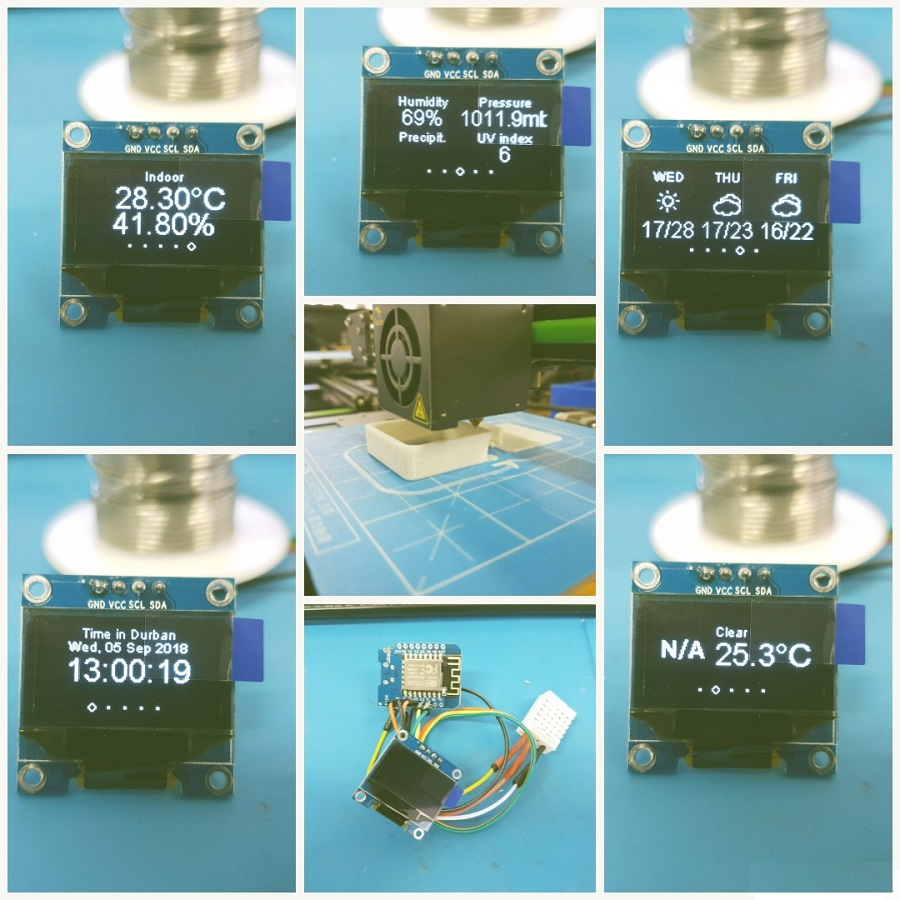
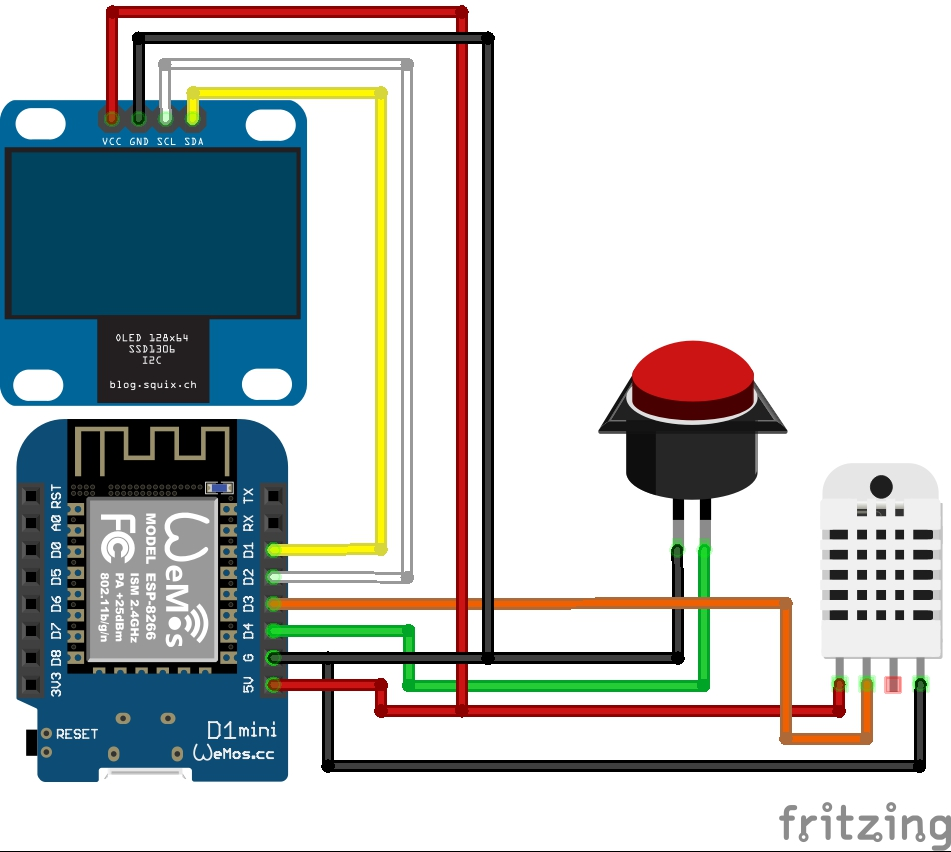

#Weather station

A neat little box that displays the weather conditions of a location of your choice. This project is easy to make and makes a good first time project for beginners. The project switches displays between the current weather, weather forecast for the next 3 days, the current date and time as well as the indoor temperature and humidity. The box also comes with a button that can be coded to switch location.

##Parts Required

[Wemos D1 Mini](https://www.diyelectronics.co.za/store/iot/1971-esp8266-wemos-d1-mini-wifi-dev-board.html?search_query=wemos&results=2) x1  
[4 Pin Oled](https://www.diyelectronics.co.za/store/displays/1432-oled-display-module-white-096-inch-128x64-4pin-i2c-iic-for-arduino.html?search_query=+oled&results=212) x1  
[DHT22 Humidity and Temp sensor](https://www.diyelectronics.co.za/store/humidity-sensors/1153-temperature-and-humidity-sensor-dht22.html?search_query=dht22&results=1) x1  

[3D printed case cover](Station_Box_Plate.stl) x1  
[3D printed case](Station_Box_with_Button_Hole.stl) x1  

##Hardware set-up

The diagram below shows clearly how to wire up all your components, a table is also included to show corresponding pins between modules.

|Wemos D1 Mini pin| Module pin|
|-|-|
|D1| SDA (OLED)|
|D2| SCL (OLED)|
|D3| Data (DHT22)|
|D4| Pin (Button)|
|Gnd| GND (OLED, Button, DHT22)|
|5V| 5V (OLED, Button, DHT22)|

##Code

All the code you will need for your station can be found in the link below, unzip the file to retrieve your files:  
[Weather station code: download](WeatherStation.zip)
