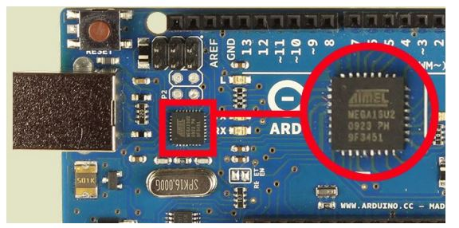

 
#Serial to USB Arduino Driver Guide

Arduino boards come with two different USB chips, 16U2 and CH340, which come with two different drivers. 
That is why we have made you a handy guide for loading your drivers.
We have even gathered all the files you will need in a zip file, that you can find  in the table below.

<table class="tg">
  <tr>
    <td  colspan="2" class="tg-24i8"><a href="RAMPS_XLoader_Guide_rev1.pdf">
USB to serial Arduino guide
</a></td>
  </tr>
  <tr>
    <th class="tg-wm6t">Chip type</th>
    <th class="tg-wm6t">Drivers</th>
  </tr>
  <tr>
    <td class="tg-031e">16U2</td>
    <td class="tg-031e"><a href="Drivers/16U2Driver.zip" download>16U2 Driver</a></td>
  </tr>
  <tr>
    <td class="tg-031e">CH340</td>
    <td class="tg-031e"><a href="Drivers/CH340Driver.zip" download>CH340 Driver</a></td>
  </tr>
</table>