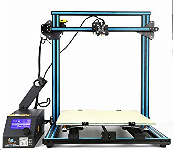

# About

Based on the CR-10 the CR-10S comes with one large printing volume at 500x500x500! This durable printer comes with Dual lead screws and a filament detector to maximize print quality.

# Specifications

|Specs|Value
|-|-|
|Nozzle Diameter| 0.4mm  
|Filament Diameter| 0.175mm
|Print area| 500*500*500mm  
|Hot Bed Temperature| 60°C  
|System| Windows, Linux, Mac  
|Power Supply| 240W
|Print Speed| 2-200mm/s  
|Layer Thickness| 0.1-0.4mm      
|SD-Card Support| yes 
|Max. Resolution| 0.1mm   
|Printing Software| Cura, Repetier-Host simplify 3D   
|Z Axis Positioning Accuracy| 0.01mm    
|XY Axis Positioning Accuracy| 0.01mm  
|Language| English

# User Guide

The video below gives a quick tutorial on how to assemble your CR10 from Creality

