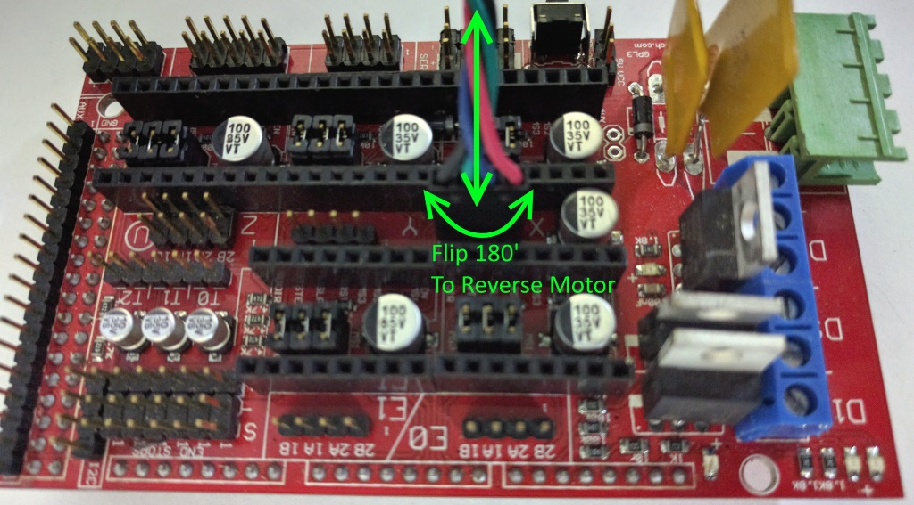
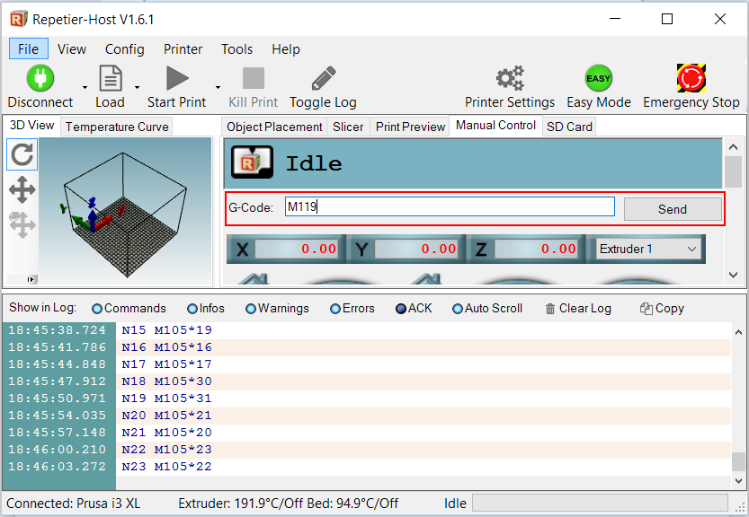
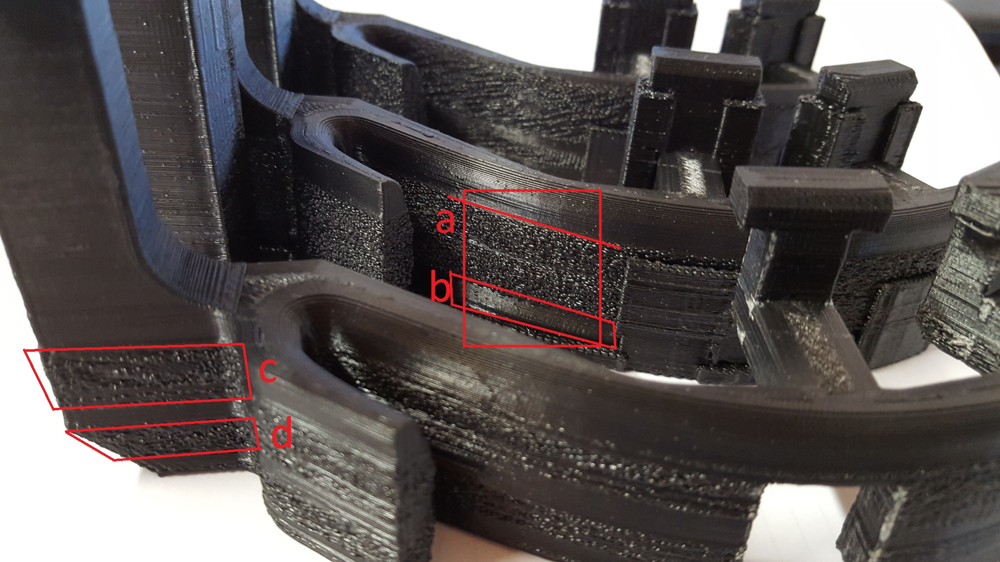
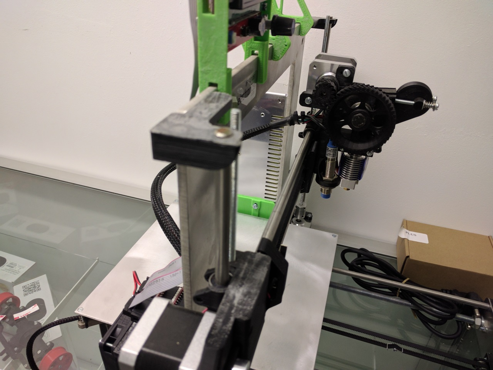

##X / Y / Z / Extruder Axis Runs in Reverse

The motor axis is reversed, the easiest way to solve this issue is (with everything powered down) to flip the motor plug on the RAMPS board 180 degrees. This will reverse the axis in question:

##Endstops Do Not Work Correctly

First make sure the axis are all moving in the correct direction. 
Next in Repetier Host send the M119 command in the G-Code command line.

Note the response in the text log: 

When the endstops are not pressed they should read as Open
You can hold an endstop down and then send M119, it should then read Triggered if it is working properly. If you do not have this response then check that the endstop is plugged into the correct port and that the wiring is not damaged. 
Ignore the Max endstops, we only use the Min endstops. 
Also check that the X endstop relates to x_min and the same for Y and Z with the M119 command. If not then they are connected to the wrong locations.

##One of the Axis Does Not Work

The first thing to try is (with the power off) swap one of the working axis stepper motor drivers with the driver on the axis that doesn't work. Test again, then we will know if the driver is faulty or if there is a different problem.

##Rough Layers in Prints

The attached picture shows how A , C and D layers are very rough and layers 
B are smooth. This seems to occur at the same levels in each of the models 
we printed.
Some are worse than others.

Solution:
Generally this problem is a function of three variables: 
Temperature too high, try reduce 5 - 10 'C
Flow rate too high, try reduce 5 - 10% or check that extruder calibration is spot on
Print speed is too high, slow down the print a little. 
Try tweak one of those variables at a time and see if you can get it printing smoothly.
Over and above those factors some filaments can be more prone to this problem than others, try printing in a different colour and see if it helps. 
Finally one of the biggest causes of this problem is related to the nozzle size, slicer and slicer settings. You may see an improvement by using a better slicer like Simplify 3D, using a smaller nozzle size, changing your layer size and adjusting the extrusion width over height factor. The layer height can also play a roll. 

Essentially it is a case of fine tuning, but once you get it right the prints will come out perfect. 

##Prusa i3 Cable Management

Cable management on your Prusa i3 kit, or any 3D printer kit, is very important in order to prevent failed prints and other cable related issues. The following guide is intended to assist with cable management on your printer. 

On the extruder, gather all cables together just above the X-carriage. Small cable-ties are useful here.

Bring the cables through the frame and down towards the RAMPS board top left corner.

Secure the extruder wiring to the top left RAMPS mounting screw with a small cable-tie.

Bring the extruder wiring bundle down to the lower left RAMPS mount and secure. Trim the red hot-end heater cable to length and insert into heater screw terminals. Bunch excess thermistor and stepper motor cable under the Arduino board. Connect Thermistor, Extruder Stepper, Hot-End Fan and (optional) Auto-Level Sensor Cables to the RAMPS board and reinstall the RAMPS fan. 

##How to adjust first layer using "Marlin Baby Stepping"

- Start print 
- Under "tune" in the main menu select "Babystepping Z"
- Turn the dial anti-clockwise to lower the nozzle closer to the print surface 
- You will have achieved the ideal nozzle position for your first layer once the filament is being lightly squashed against the print surface creating an even bead of extrusion.

##The Heated Bed Struggles to Reach 100'C or More

That's quite normal, we suggest printing ABS at 80-90'C bed temp, we find that is ideal with our aluminium build plate and ABS / Acetone solution. 

Additionally it is possible to get to 110'C if you insulate the bottom of the bed. Using an enclosure helps too. 
We find this is a bit hot for printing directly to the aluminium bed with ABS, rather this bed temp is suitable for print surfaces such as PEI. 

##Editing your G-Code / Start / End G-Code etc

G-Code is the language that is used by your printer electronics to control the printer. The slicing program / toolchain such as Slic3r or Simplify3D generates this G-Code automatically and saves it to a text based .gcode file that is then sent to your 3D printer either over a serial connection, SD card or network. 

Check out the following link for some tips on setting up the some of the configurable sections of the G-Code generation in order to fine tune your 3D printers operation: 
http://wiki.solidoodle.com/setting-and-editing-your-gcode

