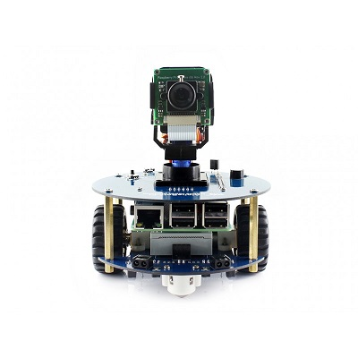

<h1 align="center">ALPHABOT2 -Pi BUILD GUIDE</h1>

#Introduction

The Alphabot2 is a small compact 2 wheel robot with many easy to connect accessories. 
The Alphabot2 requires no soldering or extra wiring, all you have to do is snap your connectors together in the right place.
The Alphabot2 is perfect for beginners in robotics to help the user grasp a basic understanding of electronics and their interactions.
The ALphabot2 does not include the raspberry pi, this has to be purchased seperately.

#Specifications

**Alphabot2 Base equipped with:**

1. Ultrasonic module interface
2. AlphaBot2 control interface
3. Obstacle avoiding indicators
4. 2 roller wheels
5. ST188: reflective infrared photoelectric sensor
6. ITR20001/T: reflective infrared photoelectric sensor
7. Potentiometer
8. TB6612FNG dual H-bridge motor driver
9. LM393 voltage comparator
10. N20 micro gear motor reduction rate 1:30, 6V/600RPM
11. Rubber wheels
12. Power switch
13. Battery holder: supports 14500 batteries
14. WS2812B: true color RGB LEDs
15. Power indicator

**Alphabot2 Pi platform equipped with:**

1. AlphaBot2 control interface
2. Raspberry Pi interface
3. Servo interface
4. USB TO UART
5. LM2596: 5V voltage regulator
6. TLC1543: 10-bit AD acquisition chip
7. PCA9685: servo controller
8. CP2102: USB TO UART converter
9. Joystick
10. IR receiver
11. Buzzer

#User Manual

Waveshare has created a manual for your Alphabot2-Pi, that is easy to follow and provides links to beginner projects and code.  
You can find the manual here:  
[Alphabot2 Pi](Alphabot2pi_manual.pdf)