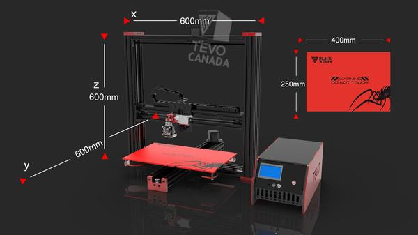

#About

An easy assembly printer based off the Prusa i3 design. All parts of the Black Widow are open source.

#Specifications

|||
|-|-|
|Layer resolution|50 microns|
|MAX Printing Speed|150 mm/s|
|Build size|200X 200 X 200mm. Large print area of 200 x 280 x 200 mm (Optional)|
|Material type| PLA, ABS, PETG, Wood, PVA and Flexible Filaments (With Pro Metal Extruder)|
|Positioning accuracy| Z 0.04mm, XY 0.012mm|
|Nozzle diameter| 0.4mm (customized 0.3mm/0.2mm)|
|Recommended extruder temperature| 210°C (the maximum can be set to 260°C)|
|Heating plate temperature| 60-120°C (proper winter warming and summer appropriate cooling)|
|Power requirements| 220V, 250W, 50Hz, 0.89A|
|Connection| TF card or USB|
|File print format| STL,G-Code|
|Compatibility |Windows, Linux, Mac|

#User guide 

[Tevo Black Widow user manual](Tevo Black Widow user manual.pdf)