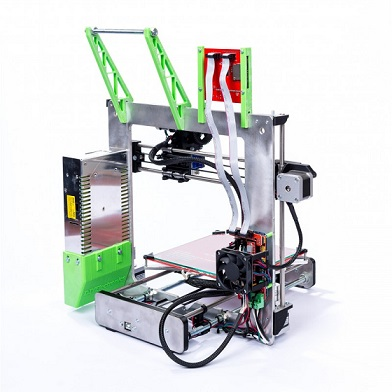

|||
|-|-|
|||

#Navigation Guide to our I3 build docs

First step to your 3D printer is the mechanical assembly and CharlStruder assembly.
If you have the auto-bed-leveling upgrade you will also need to look at The Auto bed leveling manual.
Lastly install your electronics and software.

_Note_:

* Your electronics come tested and configured with the correct firmware and there
is NO need to flash your Arduino yourself.

* When heating your hotend for the first time tighten all parts due to heat-expansion.

* For printing ABS get some acetone and decant into a glass jar, say 3cm or so.
Cut 50cm of abs filament into pieces and add to acetone. Mix until dissolved.
Paint this on the heat bed before heating when preparing to print. Also purchase
a paint scraper and sharpen the edge. When removing prints use this and a
small hammer to prise print off the bed.

##Specifications

|Specs|Value
|-|-|
|Nozzle Diameter| 0.4/0.5mm  
|Filament Diameter| 0.175mm    
|Hot Bed Temperature|   
|System|   
|Power Supply| 240W  
|Print Speed|  
|Layer Thickness| 0.1-0.4mm    
|Color Print Speed| s   
|SD-Card Support| yes  
|Max. Resolution|    
|Printing Software| Cura   
|Z Axis Positioning Accuracy|     
|XY Axis Positioning Accuracy|   
|Language| English   

#Build Documentation

* [I3 Mechanical assembly guide](I3 Mechanical assembly guide.pdf)
* [CharlStruder assembly guide](CharlStruder assembly guide.pdf)
* [I3 Electronics and Software guide](I3 Electronics and Software guide.pdf)
* [I3 Auto-leveling manual](Auto leveling manual.pdf)
