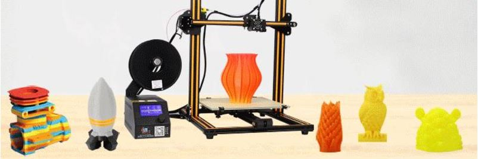

# About

With quick installation and low prices, its easy to see why the Creality CR-10 is becoming so popular amongst our costumers.

The design of this printer promotes high accuracy and low noise with a large build volume.

# Specifications

| Specifications      | Value                           |
| ------------------- | ------------------------------- |
| Power Supply        | 240W                            |
| Print speed         | 100mm/s                         |
| Sd-card support     | Yes                             |
| Printing software   | Cura, simplify3d, Repetier-Host |
| Print area          | 300x300x400mm                   |
| Nozzle Diameter     | 0,2mm/0,3mm/0.4mm               |
| Printing accuracy   | 0.1mm                           |
| Hot Bed Temperature | N/A                             |

# User Guide

The video below gives a quick tutorial on how to assemble your CR10 from Creality

