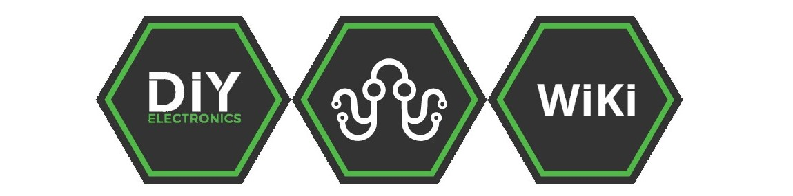
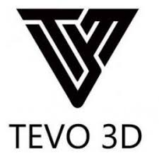
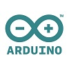

|<b><a href="https://www.diyelectronics.co.za/store/" style="color: rgb(81, 184, 72)">DIYElectronics Store</a></b>| <b><a href="https://www.diyelectronics.co.za/blog/" style="color: rgb(81, 184, 72)">DIYElectronics Store</a></b> |
|-|-|

DIYElectronics is commited as a company to provide you with the widest range of electronics to suit your professional or hobby needs. We understand that good electronics is important to any project,
we also understand that every new project brings a host of new challenges. That is why we have created this WIKI for you, to help you in your projects, whether you are buying your first 3d printer
or building a rocket to the moon, our aim is to make every step of your creative journey just a little bit easier.

<table class="tg">
  <tr>
    <th class="tg-h25t"><b>DIYElectronics</b></th>
    <th class="tg-h25t"><b>Anycubic</b></th>
    <th class="tg-h25t"><b>Tevo</b></th>
    <th class="tg-h25t"><b>Creality</b></th>
    <th class="tg-h25t" colspan="2"><b>Wanhao</b></th>
  </tr>
  <tr>
    <td class="tg-yw4l"></td>
    <td class="tg-yw4l"></td>
    <td class="tg-yw4l"></td>
    <td class="tg-yw4l"></td>
    <td class="tg-yw4l"></td>
  </tr>
  <tr>
    <td class="tg-yw4l"><a href="3DPrinters/DIYPrinters/builddoc/">DIY Prusa I3</a></td>
    <td class="tg-yw4l"><a href="3DPrinters/Anycubic/AncubicI3Mega">Ancyubic I3 Mega</a></td>
    <td class="tg-yw4l"><a href="3DPrinters/Tevo/TevoTran">Tevo  Tarantula</a></td>
    <td class="tg-yw4l"><a href="3DPrinters/Creality/crealityCR10">Creality CR10</a></td>
    <td class="tg-yw4l"><a href="3DPrinters/Wanhao/builddocplus/">Duplicator I3 </a>
  </tr>
  <tr>
    <td class="tg-yw4l"><a href="3DPrinters/DIYPrinters/builddocprem/">DIY Prusa I3 Premium</a></td>
    <td class="tg-yw4l" ><a href="3DPrinters/Anycubic/AnyycubicKossDelt">Anycubic Kossel Delta</a></td>
    <td class="tg-yw4l"><a href="3DPrinters/Tevo/lilmon">Tevo Little Monster</a></td>
    <td class="tg-yw4l"><a href="3DPrinters/Creality/Creality10S">Creality CR10S</td>
    <td class="tg-yw4l"><a href="3DPrinters/Wanhao/WanD7plus/">Duplicator 7</a>
  </tr>
  <tr>
    <td class="tg-yw4l"><a href="3DPrinters/DIYPrinters/DIYoverview">See More >>></a></td>
    <td class="tg-yw4l"><a href="3DPrinters/Anycubic/Anycubicoverview">See More >>></a></td>
    <td class="tg-yw4l"><a href="3DPrinters/Tevo/Tevooverview">See More >>></a></td>
    <td class="tg-yw4l"><a href="3DPrinters/Creality/Crealityoverview">See More >>></td>
    <td class="tg-yw4l"><a href="3DPrinters/Wanhao/Wanhaooverview">See More >>></a>
  </tr>
</table>

<table class="tg">
  <tr>
    <th class="tg-4mlq"><b>Arduino</b></th>
  </tr>
  <tr>
    <td class="tg-031e"></td>
  </tr>
    <tr>
    <td class="tg-031e"><a href="Arduino/Arduino101">Arduino101</td>
  </tr>
  <tr>
    <td class="tg-031e"><a href="Arduino/RAMPS_XLoader_Guide_rev1.pdf">RAMPS programming Guide</a></td>
  </tr>
    <td class="tg-yw4l"><a href="Arduino/Alphabot">Arduino Alphabot Guide</a></td>
  </tr>
</table>

<table class="tg">
  <tr>
    <th class="tg-m1sd"><b>Kits</b></th>
  </tr>
  <tr>
    <td class="tg-031e"></td>
  </tr>
  <tr>
    <td class="tg-yw4l"><a</a> </td>
  </tr>
    <td class="tg-yw4l"><a href="Arduino/Alphabot">Arduino Alphabot Guide</a></td>
  </tr>
</table>

