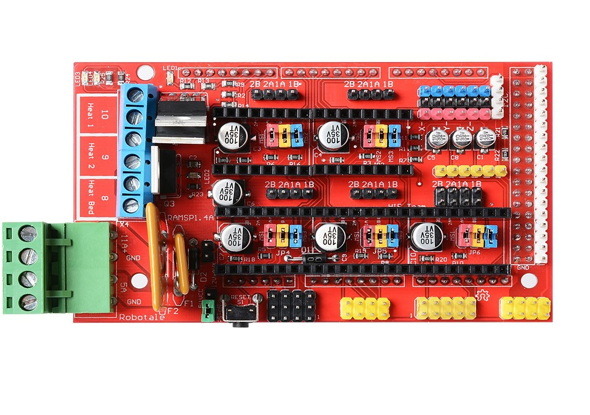

|DIYelectronics|Wanhao|Anycubic|Tevo|Creality|
|-----------------------------------|-------------------------------|----------------------------------|-|-|
||||| 
|[Build guide](builddoc.md)|[Wanhao i3](I3 plus Wanhao manual.pdf)|[i3 Mega](AncubicI3Mega.md)|[Tarantula Prusa i3](TevoTran.md)|[Creality CR10](crealityCR10.md)|
|[DIY i3 Build doc](builddoc.md)|[Duplicator i3 Plus](Duplicatori3plus.md)|[Kossel Delta](AnyycubicKossDelt.md)|[Black Widow](TevBlkWid.md)||
||[Duplicator 6](WanDup6.md)|| [Little Monster](lilmon.md)|

|RAMPS Guide|2WD Arduino car|
|--|--|
||
|[RAMPS programming guide](RAMPS_XLoader_Guide_rev1.pdf)|[2WD robot build guide](ARDUINO_2WD_SMART_ROBOT_CAR.pdf)|

