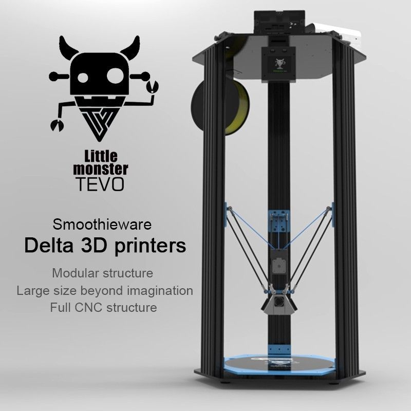

#About

This partially pre-assembled printer is a great addition to your 3D printer collection. Dont be fooled by its name, the Little Monster comes with a large build volume of 340mm by 500mm.

#Specifications

#Build guide
Follow the link below to a full build guide to the Tevo Little Monster printer

[Little Monster guide](Monster Manual.pdf)